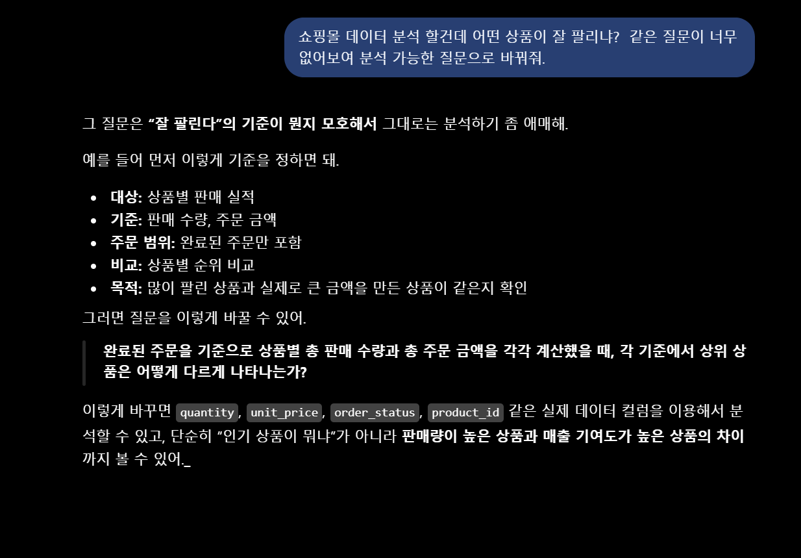
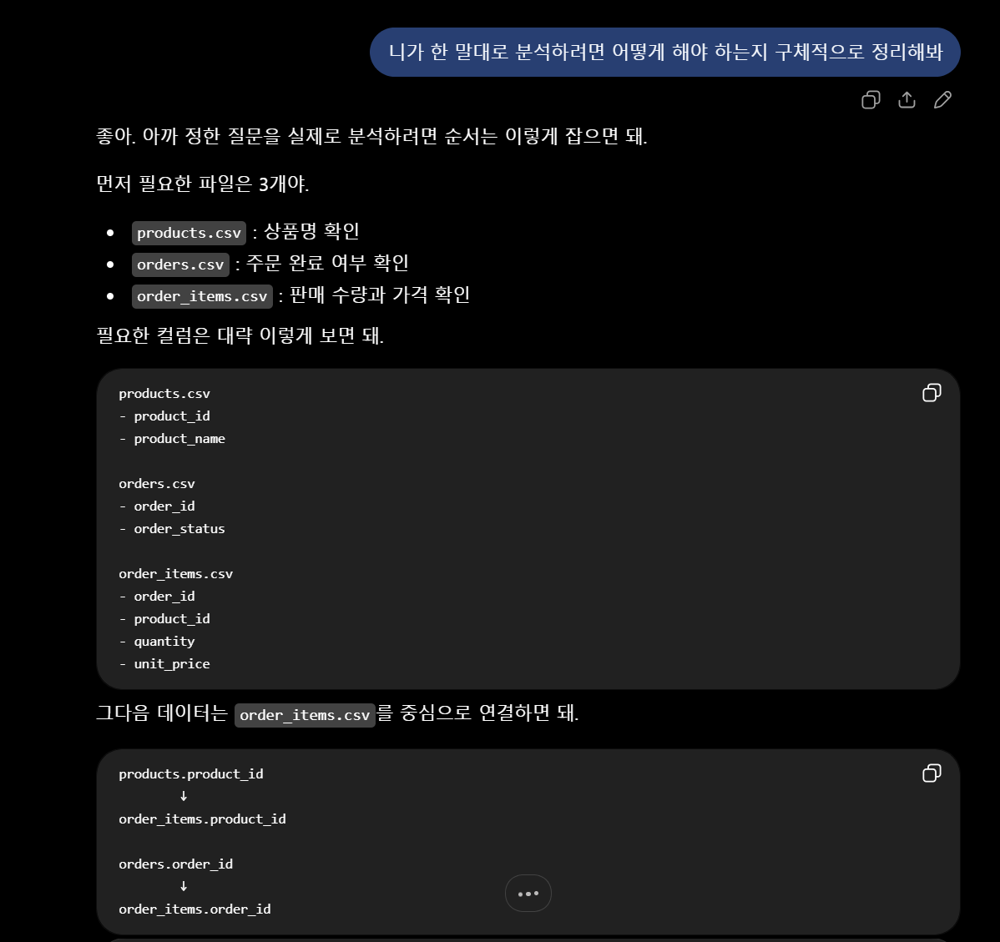
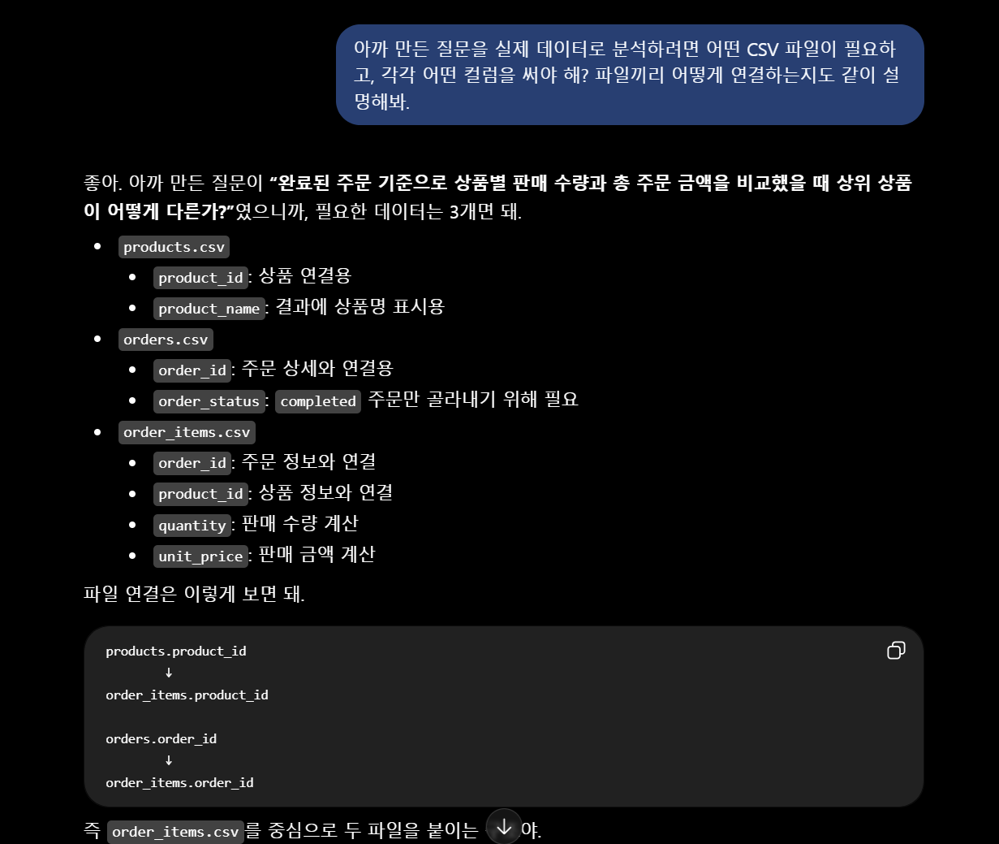
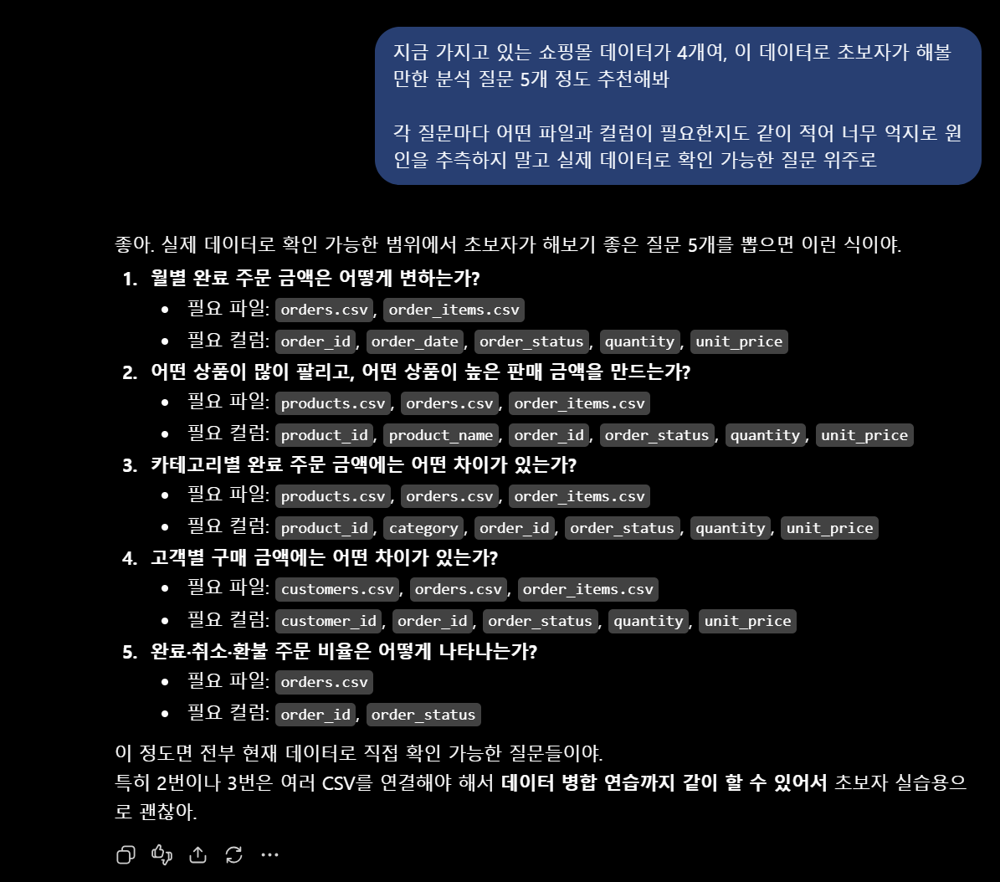
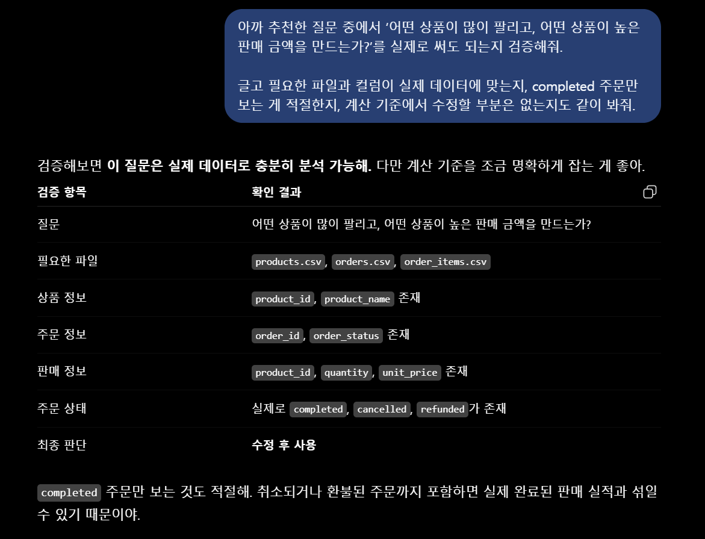
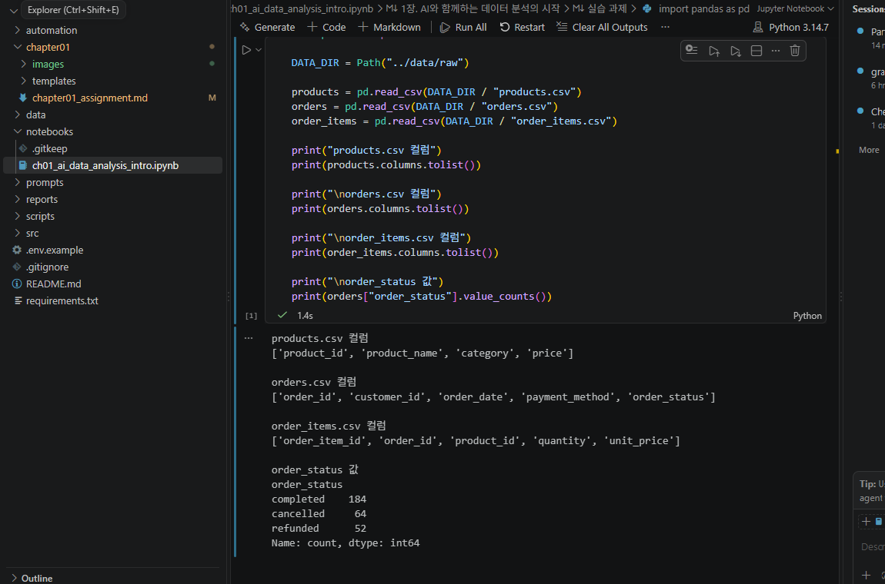
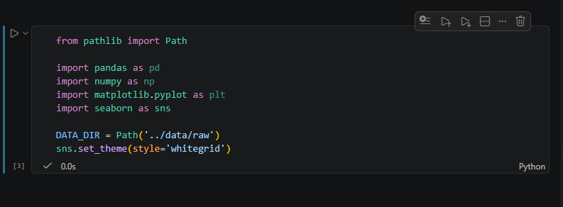

# Chapter 01 제출 답안. AI와 함께하는 데이터 분석의 시작

> Chapter 01 실습 결과를 정리한 제출용 답안입니다.  
> 실제 실행 화면과 Evidence 이미지는 로컬에서 확인 후 추가합니다.

---

## 0. 제출 정보

- 이름: 조영우
- GitHub ID: `cyw0927`
- 개인 저장소명: `-llm-data-analysis-course`
- 작성일: 2026-09-03
- 사용한 LLM: ChatGPT

### 최종 제출 URL

```text
https://github.com/cyw0927/-llm-data-analysis-course/blob/main/chapter01/chapter01_assignment.md
```

---

## 1. 원래 업무 질문

### 내가 선택한 막연한 질문

```text
어떤 상품이 잘 팔리고 있나요?
```

### 왜 이 질문이 모호하다고 생각했는가?

- 대상: 어떤 상품을 어떤 범위에서 비교할 것인지 정해져 있지 않다.
- 기간: 기간이 정해져있지 않다
- 기준: 판매 수량이 많은 상품인지, 주문 금액이 큰 상품인지 아무런 기준이 없다.
- 비교 방법: 상품 간 순위를 어떤 지표로 비교할 것인지 정해져 있지 않다.
- 분석 목적: 단순 인기 상품 확인인지, 재고·판매 전략 검토를 위한 것인지 목적이 명확하지 않다.

### 분석 가능한 질문으로 다시 작성

```
전체 제공 기간의 완료(completed) 주문을 기준으로 상품별 총 판매 수량과 총 주문 금액을 계산했을 때,
각 기준에서 상위 상품은 어떻게 다르게 나타나는가?
```

### 결과 관찰

처음 질문의 "잘 팔린다"는 표현에는 판매 수량, 판매 금액, 주문 건수 등 여러 의미가 포함될 수 있었다. 

질문을 구체화하면서 이번 실습에서는 **판매 수량**과 **완료 주문 기준 주문 금액**을 각각 계산하여 비교하기로 했다.

또한 취소되거나 환불된 주문까지 함께 계산하지 않도록 `completed` 주문만 대상으로 정하면서 계산 범위를 명확하게 만들었다.

### 나의 해석과 판단

판매 수량이 많은 상품이 항상 주문 금액도 큰 상품이라고 볼 수는 없다. 가격이 낮은 상품은 많은 수량이 판매되어도 총금액이 상대적으로 낮을 수 있고, 반대로 가격이 높은 상품은 판매 수량이 적어도 큰 금액을 만들 수 있다.

따라서 두 지표를 따로 계산한 뒤 상위 상품이 어떻게 달라지는지 비교하는 것이 "잘 팔리는 상품"을 한 가지 기준으로 단정하는 것보다 적절하다고 판단했다.

### 업무·분석적 의미

판매 수량이 높은 상품과 주문 금액이 높은 상품을 구분하면 상품의 판매 특성을 조금 더 구체적으로 볼 수 있다. 

판매 수량이 높은 상품은 재고 관리와 수요 대응 측면에서 중요할 수 있고, 주문 금액이 높은 상품은 금액 기여도가 높은 상품으로 별도로 살펴볼 수 있다.

다만 이 결과만으로 발주량이나 마케팅 전략을 바로 결정하기보다는 이후 카테고리, 기간, 가격, 재고 등 다른 정보와 함께 검토할 필요가 있다.

### 한계와 추가 확인 사항

현재 질문만으로 상품이 많이 판매된 **원인**까지 알 수는 없다. 

할인 행사, 광고, 계절성, 재고량과 같은 정보가 데이터에 없다면 판매 결과만으로 원인을 단정해서는 안 된다.

또한 본격적인 분석 전에는 `quantity`, `unit_price`의 결측·이상값, 상품 및 주문 ID 연결 누락 여부 등을 추가로 확인해야 한다.

### Evidence

> TODO: 로컬에서 STEP 1 작성 화면을 캡처한 뒤 아래 경로에 이미지를 추가한다.




---

## 2. 질문과 필요한 데이터 연결

### 필요한 데이터 파일

- [ ] `customers.csv`
- [x] `products.csv`
- [x] `orders.csv`
- [x] `order_items.csv`

이번 질문에서는 고객 특성을 분석하지 않기 때문에 `customers.csv`는 우선 사용하지 않는다.

### 필요한 컬럼 후보

| 파일 | 필요한 컬럼 | 필요한 이유 |
| --- | --- | --- |
| `products.csv` | `product_id`, `product_name` | 상품 ID로 데이터를 연결하고 최종 결과에 상품명을 표시하기 위해 필요하다. |
| `orders.csv` | `order_id`, `order_status` | 주문 상세와 연결하고 `completed` 주문만 선택하기 위해 필요하다. |
| `order_items.csv` | `order_id`, `product_id`, `quantity`, `unit_price` | 주문·상품을 연결하고 판매 수량 및 주문 금액을 계산하기 위해 필요하다. |

### 실제 데이터에서 확인한 컬럼

실제 CSV 헤더를 확인한 결과 다음 컬럼이 존재한다.

```text
products.csv
product_id, product_name, category, price

orders.csv
order_id, customer_id, order_date, payment_method, order_status

order_items.csv
order_item_id, order_id, product_id, quantity, unit_price
```

또한 `orders.csv`의 샘플에서 `completed`, `cancelled`, `refunded`와 같은 주문 상태 값이 존재하는 것을 확인했다.

### 데이터 연결 관계

```text
products.product_id
        ↓
order_items.product_id

orders.order_id
        ↓
order_items.order_id
```

`order_items.csv`를 중심으로 `products.csv`와 `orders.csv`를 연결하면 상품 정보, 판매 수량, 판매 당시 단가, 주문 상태를 함께 사용할 수 있다.

상품별 주문 금액은 다음과 같이 계산할 수 있다.

```text
주문 금액 = quantity × unit_price
```

그 다음 `order_status == 'completed'`인 주문만 남기고 상품별로 `quantity` 합계와 주문 금액 합계를 각각 집계한다.

### 결과 관찰

하나의 CSV만으로는 이번 질문에 답하기 어렵다는 것을 확인했다. `order_items.csv`에는 수량과 판매 당시 단가가 있지만 상품명과 주문 상태가 없기 때문에 `products.csv`, `orders.csv`와의 연결이 필요하다.

즉, 필요한 정보가 여러 파일에 나누어 저장되어 있으며 `product_id`, `order_id`가 파일을 연결하는 핵심 키 역할을 한다.

### 나의 해석과 판단

필요한 컬럼과 연결 키가 실제 데이터에 존재하고 `completed` 상태도 확인했기 때문에 현재 제공 데이터로 이번 질문을 분석하는 것은 가능하다고 판단했다.

다만 "컬럼이 존재한다"는 사실만으로 데이터 품질까지 보장되는 것은 아니다. 실제 계산 전에 결측, 중복, 자료형, 연결되지 않는 ID가 있는지 확인해야 한다.

### 업무·분석적 의미

질문을 먼저 데이터 구조와 연결하면 필요한 파일과 컬럼을 명확하게 정할 수 있다. 반대로 데이터 구조를 확인하지 않은 채 바로 코드를 작성하면 존재하지 않는 컬럼을 사용하거나 잘못된 범위의 데이터를 집계할 수 있다.

따라서 분석 질문을 정한 뒤 실제 데이터 구조로 다시 검증하는 과정이 필요하다고 생각한다.

### 한계와 추가 확인 사항

아직 전체 행을 대상으로 다음 항목을 검증하지 않았다.

- `quantity`, `unit_price`의 결측값 및 이상값 여부
- `product_id`, `order_id`의 중복 또는 연결 누락 여부
- 취소·환불 주문을 제외한 계산 범위가 업무 목적에 맞는지
- `unit_price`가 실제 판매 당시 가격인지, 할인·배송비·세금 등이 별도로 존재하는지

따라서 현재 단계에서는 **분석에 필요한 구조는 확인했지만 데이터 품질 검증은 추가로 필요하다**고 판단한다.

### Evidence

> TODO: CSV 헤더 또는 파일 관계를 확인한 화면을 캡처하여 추가한다.



---

## 3. LLM에게 분석 질문 후보 요청

### 사용 목적

온라인 쇼핑몰 데이터로 어떤 분석을 먼저 할 수 있는지 질문 후보를 얻고, 각 질문에 필요한 파일과 컬럼을 정리하기 위해 LLM을 사용했다. LLM의 제안을 그대로 정답으로 사용하지 않고 실제 CSV 구조와 비교하여 사용할 수 있는 질문인지 검토하는 것을 목적으로 했다.

### 사용한 Prompt

```text
온라인 쇼핑몰 데이터 분석을 준비하고 있습니다.

데이터는 다음 4개 파일로 구성됩니다.
- customers: 고객 정보
- products: 상품 정보
- orders: 주문 정보
- order_items: 주문 상세 정보

목적은 completed 주문 기준 금액과 상품 판매 패턴을 이해하는 것입니다.
초보 데이터 분석자가 먼저 확인할 분석 질문 5개를 제안해 주세요.
각 질문마다 필요한 데이터 파일과 확인할 컬럼 후보도 적어 주세요.
원인을 단정하지 말고 현재 데이터로 확인 가능한 질문만 제안해 주세요.
```

### LLM 답변 요약

1. **월별 completed 주문 금액은 어떻게 변하는가?**  
   - 필요 파일: `orders.csv`, `order_items.csv`  
   - 주요 컬럼: `order_id`, `order_date`, `order_status`, `quantity`, `unit_price`

2. **카테고리별 completed 주문 금액은 어떻게 다른가?**  
   - 필요 파일: `products.csv`, `orders.csv`, `order_items.csv`  
   - 주요 컬럼: `product_id`, `category`, `order_id`, `order_status`, `quantity`, `unit_price`

3. **상품별 판매 수량 상위 상품과 주문 금액 상위 상품은 어떻게 다른가?**  
   - 필요 파일: `products.csv`, `orders.csv`, `order_items.csv`  
   - 주요 컬럼: `product_id`, `product_name`, `order_id`, `order_status`, `quantity`, `unit_price`

4. **주문당 평균 구매 금액은 월별로 어떤 차이가 있는가?**  
   - 필요 파일: `orders.csv`, `order_items.csv`  
   - 주요 컬럼: `order_id`, `order_date`, `order_status`, `quantity`, `unit_price`

5. **주문 상태별 비중은 기간에 따라 어떻게 달라지는가?**  
   - 필요 파일: `orders.csv`  
   - 주요 컬럼: `order_date`, `order_status`

### 결과 관찰

LLM은 월별 추이, 카테고리 비교, 상품 비교, 평균 주문 금액, 주문 상태 비중처럼 서로 다른 관점의 질문을 제안했다. 질문 자체는 분석 아이디어를 빠르게 넓히는 데 도움이 되었지만, 각 질문을 실제로 사용할 수 있는지는 데이터에 필요한 컬럼이 존재하는지 확인해야 했다.

### 나의 해석과 판단

제안 중 **상품별 판매 수량과 주문 금액의 상위 상품을 비교하는 질문**은 처음에 정한 업무 질문과 직접 연결되므로 우선적으로 사용하기 적합하다고 판단했다.

반면 월별 분석이나 평균 주문 금액 분석은 가능한 질문이지만 이번 Chapter의 중심 질문을 해결하는 데 반드시 필요한 것은 아니므로 후속 분석 후보로 남겨두었다.

### 업무·분석적 의미

LLM은 분석 초기에 생각하지 못한 질문 후보를 빠르게 만들고 필요한 컬럼의 후보까지 제안해 줄 수 있다는 장점이 있다. 특히 막연한 질문을 여러 개의 측정 가능한 질문으로 바꾸는 데 유용하다.

하지만 실제 데이터 구조와 업무 기준을 모르는 상태에서 생성한 제안이므로 최종 분석 질문을 선택하고 범위를 정하는 것은 사람이 해야 한다.

### 한계와 추가 확인 사항

LLM이 제안한 컬럼명이 실제 데이터에 존재하는지, 주문 금액 계산 기준이 무엇인지, `completed` 주문만 포함하는 것이 적절한지 검증해야 한다. 또한 데이터에 없는 정보로 판매 원인이나 고객 행동의 원인을 단정하지 않도록 주의해야 한다.

### Evidence

> TODO: 이 Prompt와 LLM 응답이 보이는 화면을 캡처하여 추가한다.



---

## 4. LLM 제안 검증

LLM 제안 중 다음 질문을 선택해 검토했다.

| 검증 항목 | 확인 내용 |
| --- | --- |
| 선택한 LLM 제안 | 상품별 판매 수량 상위 상품과 주문 금액 상위 상품은 어떻게 다른가? |
| 필요한 파일 | `products.csv`, `orders.csv`, `order_items.csv` |
| 필요한 컬럼 | `product_id`, `product_name`, `order_id`, `order_status`, `quantity`, `unit_price` |
| 계산 범위 | 전체 제공 기간, `completed` 주문만 사용 |
| 실제 데이터 확인 필요 여부 | 주요 컬럼과 `completed` 값은 확인함. 결측·중복·자료형은 추가 확인 필요 |
| 원인 단정 여부 | 판매 결과의 차이만 비교하고 판매 원인은 단정하지 않음 |
| 최종 판단 | **수정 후 사용** |

### 내가 수정한 내용

```text
기존 제안은 비교 대상은 명확했지만 기간과 주문 상태 범위가 충분히 구체적이지 않았다.
따라서 "전체 제공 기간의 completed 주문"으로 범위를 명시하고,
판매 수량과 주문 금액을 각각 집계하여 상위 상품을 비교하는 질문으로 수정했다.
```

수정한 최종 질문:

```text
전체 제공 기간의 완료(completed) 주문을 기준으로 상품별 총 판매 수량과 총 주문 금액을 계산했을 때,
각 기준에서 상위 상품은 어떻게 다르게 나타나는가?
```

### 결과 관찰

실제 CSV에서 필요한 컬럼이 존재하고 `orders.csv`에 `completed` 상태가 존재하는 것을 확인했다. 따라서 질문에 필요한 기본 데이터 구조는 갖추어져 있다.

다만 아직 전체 데이터의 결측·중복·이상값까지 검증한 것은 아니므로 즉시 최종 결과를 확정할 단계는 아니다.

### 나의 해석과 판단

LLM의 질문 방향 자체는 사용할 수 있지만 그대로 사용하면 분석 기간과 주문 상태 범위가 불분명했다. 분석 기준을 사람이 추가로 정의해야 같은 데이터를 사용하더라도 일관된 결과를 얻을 수 있다고 판단해 **수정 후 사용**으로 결정했다.

### 업무·분석적 의미

LLM 제안을 검증하지 않고 바로 사용하면 취소 주문을 매출성 주문처럼 계산하거나, 존재하지 않는 컬럼을 기준으로 코드를 작성하는 문제가 생길 수 있다. 또한 계산은 실행되더라도 업무에서 의미하는 지표와 다른 값을 만들 가능성이 있다.

따라서 LLM이 만든 질문과 코드는 실제 데이터 구조와 분석 기준을 확인한 뒤 사용해야 한다.

### 한계와 추가 확인 사항

- 전체 행의 결측값과 중복 여부
- `quantity`, `unit_price`의 자료형 및 이상값
- `order_id`, `product_id` 연결 시 누락되는 행의 존재 여부
- `quantity × unit_price`가 이번 수업에서 정의하는 주문 금액 범위와 일치하는지

이 항목들은 실제 pandas 실행 단계에서 추가로 확인할 예정이다.

### Evidence

> TODO: 실제 CSV 컬럼과 LLM 제안을 비교한 화면을 캡처하여 추가한다.



---

## 5. Prompt Log

- 사용 목적: 쇼핑몰 데이터에서 먼저 확인할 분석 질문 후보를 얻고 실제 데이터로 검증하기 위해 사용
- 입력 Prompt 요약: 4개 쇼핑몰 데이터 파일을 설명하고 `completed` 주문 금액 및 상품 판매 패턴 관련 분석 질문 5개와 필요한 컬럼을 요청
- LLM 답변 요약: 월별 주문 금액, 카테고리별 금액, 상품별 판매 수량·금액, 평균 주문 금액, 주문 상태 비중 분석을 제안
- 실제 반영 여부: 상품별 판매 수량과 주문 금액 상위 상품 비교 질문을 선택하여 반영
- 사람이 검증한 항목: 필요한 파일, 실제 CSV 컬럼, `completed` 상태 존재 여부, 계산 범위, 원인 단정 여부
- 사람이 수정한 내용: 전체 제공 기간과 `completed` 주문이라는 범위를 명시하고 판매 수량과 주문 금액을 별도로 계산하도록 질문을 구체화
- 남은 확인 사항: 결측·중복·자료형·이상값 및 파일 연결 누락 여부

### 결과 관찰

Prompt Log를 통해 LLM이 처음 제안한 내용과 최종적으로 사람이 선택·수정한 내용이 다르다는 것을 확인할 수 있다. 단순히 "AI를 사용했다"고 기록하는 것보다 어떤 제안을 받았고 무엇을 검증하여 반영했는지를 남기는 것이 중요하다고 생각한다.

### 나의 해석과 판단

Prompt Log를 남기면 나중에 분석 결과가 달라졌을 때 어떤 가정과 판단을 사용했는지 다시 추적하기 쉽다. 또한 LLM이 만든 부분과 사람이 검증하거나 수정한 부분을 구분할 수 있기 때문에 분석 과정의 근거를 설명하는 데 도움이 된다.

### Evidence

> TODO: Prompt Log 작성 화면을 캡처하여 추가한다.



---

## 6. 개인정보와 Secret 보호 확인

다음 항목을 확인한다.

- [x] 실제 이름·이메일·전화번호 등 고객 개인정보를 Prompt에 사용하지 않았다.
- [x] API Key를 코드나 Notebook에 직접 작성하지 않았다.
- [x] `.env` 실제 내용을 캡처하거나 업로드하지 않았다.
- [x] GitHub Token, 비밀번호, 내부 URL을 답안에 포함하지 않았다.
- [ ] 제출 전 추가할 Evidence 이미지에 민감정보가 보이지 않는지 최종 확인한다.

### 나의 판단

이번 실습에서는 공개된 가상 쇼핑몰 데이터의 **파일명과 컬럼 구조처럼 분석에 필요한 최소한의 정보만** LLM에 제공하는 방식이 적절하다고 판단했다.

실제 업무라면 고객 이름, 이메일, 전화번호, 주소, 결제 정보와 같은 개인정보뿐 아니라 API Key, Access Token, 비밀번호, `.env` 실제 내용, 회사 내부 URL 및 비공개 자료도 Public GitHub나 승인되지 않은 외부 LLM에 입력하면 안 된다.

특히 Secret은 코드에서 동작하기만 하면 되는 정보가 아니라 외부에 노출될 경우 계정이나 시스템 접근에 악용될 수 있으므로 환경변수와 `.gitignore` 등을 사용하여 별도로 관리해야 한다.

---

## 7. Chapter 01 Notebook 확인

Notebook:

```text
notebooks/ch01_ai_data_analysis_intro.ipynb
```

### 현재 상태

```text
Notebook 파일은 저장소에 준비한다.
현재 답안 작성 단계에서는 실제 실행 결과를 확인하지 않았으므로 실행 완료로 표시하지 않는다.
로컬 VS Code/Jupyter 환경에서 직접 실행한 뒤 결과와 Evidence를 추가한다.
```

### 실행할 기본 코드

```python
from pathlib import Path

import pandas as pd
import numpy as np
import matplotlib.pyplot as plt
import seaborn as sns

DATA_DIR = Path('../data/raw')
sns.set_theme(style='whitegrid')
```

데이터 로드 확인 예시:

```python
customers = pd.read_csv(DATA_DIR / 'customers.csv')
customers.head()
```

### 실행 결과

```text
TODO: 로컬에서 Notebook을 실행한 뒤 오류 없이 실행되었는지 작성한다.
```

### 결과 관찰

현재 Notebook은 완성된 분석 결과를 제공하는 파일이라기보다 pandas, numpy, matplotlib, seaborn과 데이터 경로를 준비한 **starter scaffold**에 가깝다. 실제 질문에 답하기 위한 데이터 로드, 전처리, 병합, 집계 코드는 이후 직접 추가해야 한다.

### 나의 해석과 판단

starter scaffold는 분석을 대신 수행하는 완성본이 아니라 실습을 시작할 수 있도록 기본 환경과 코드 골격을 준비해 둔 파일이라고 이해했다. 따라서 Notebook이 열린다는 사실만으로 Chapter 01의 분석 검증이 끝난 것은 아니다.

### 한계와 추가 확인 사항

Chapter 02~03에서는 Python/Jupyter 실행 환경, CSV 로드, 데이터 타입, 결측·중복, 파일 간 병합 결과를 실제 코드로 확인할 필요가 있다.

### Evidence

> TODO: Notebook을 실제 실행한 뒤 화면을 캡처하여 추가한다.



---

## 8. Chapter 01 최종 해석

### 이번 장에서 가장 중요하다고 생각한 내용

데이터 분석은 코드를 먼저 작성하는 것이 아니라 **무엇을 확인할 것인지 질문을 명확하게 만드는 것부터 시작한다**는 점이 가장 중요하다고 생각했다. LLM은 질문이나 코드의 초안을 빠르게 제안해 줄 수 있지만, 제안이 실제 데이터 구조와 맞는지는 자동으로 보장하지 않는다. 따라서 실제 컬럼과 계산 기준을 확인하고, 결과가 질문에 제대로 답하고 있는지 사람이 검증해야 한다. 결국 LLM의 답변은 최종 정답이라기보다 검토해야 할 초안으로 사용하는 것이 적절하다고 생각한다.

### LLM을 데이터 분석에 사용할 때 가장 조심해야 할 점

LLM의 답변이 자연스럽고 그럴듯하다는 이유만으로 실제 데이터에 맞는 분석이라고 판단하면 안 된다. 존재하지 않는 컬럼을 제안할 수도 있고, 계산 범위를 임의로 가정하거나 데이터로 확인할 수 없는 원인을 설명할 수도 있다.

따라서 **실제 데이터 구조 확인 → 코드 실행 → 계산 결과 확인 → 해석 검토** 과정을 거친 뒤 최종 판단을 내려야 한다. 또한 실제 업무 데이터에서는 개인정보와 Secret을 LLM에 입력하지 않는 것도 중요하다.

### 사람과 LLM의 역할 차이

| 항목 | LLM이 도울 수 있는 부분 | 사람이 책임져야 하는 부분 |
| --- | --- | --- |
| 질문 정의 | 막연한 질문을 분석 질문 후보로 바꾸고 여러 관점을 제안 | 실제 업무 목적에 맞는 질문인지 결정하고 범위를 확정 |
| 데이터 확인 | 필요한 파일·컬럼 후보 및 품질 점검 항목 제안 | 실제 컬럼, 자료형, 결측, 중복, 업무 기준 확인 |
| 코드 작성 | pandas 병합·집계·시각화 코드 초안 작성 | 코드가 실제 데이터와 계산 정의에 맞는지 실행·검증 |
| 결과 해석 | 표와 그래프에 대한 설명 문장 초안 작성 | 수치와 근거를 확인하고 과장·원인 단정을 제거 |
| 최종 판단 | 선택지나 후속 분석 아이디어 제안 | 분석 결론, 한계, 의사결정에 대한 최종 책임 |

### 다음 Chapter에서 확인하고 싶은 것

다음 Chapter에서는 실제 CSV를 pandas로 불러오고 `orders`, `order_items`, `products`를 직접 병합해 보고 싶다. 특히 `quantity × unit_price`로 주문 금액을 만든 뒤 `completed` 주문만 필터링하여 상품별 판매 수량과 주문 금액 순위가 실제로 어떻게 달라지는지 확인하고 싶다.

또한 결측값, 중복값, 데이터 타입과 같이 분석 전에 확인해야 하는 데이터 품질 검사를 실제 코드로 어떻게 진행하는지도 확인하고 싶다.

---

## 9. 최종 제출 체크리스트

- [x] 원래 업무 질문과 구체화한 분석 질문을 작성했다.
- [x] 질문에 필요한 데이터 파일과 컬럼 후보를 정리했다.
- [x] LLM Prompt와 답변 요약을 작성했다.
- [x] LLM 제안을 실제 데이터 관점에서 검증했다.
- [x] 각 핵심 STEP의 결과 관찰을 작성했다.
- [x] 각 핵심 STEP의 나의 해석과 판단을 작성했다.
- [x] 업무·분석적 의미를 작성했다.
- [x] 한계와 추가 확인 사항을 작성했다.
- [ ] 핵심 실행 Evidence 이미지를 첨부했다.
- [ ] 이미지가 Markdown에서 정상 표시되는지 확인했다.
- [x] 현재 작성된 텍스트에 고객 개인정보를 포함하지 않았다.
- [x] API Key·Secret·Token을 포함하지 않았다.
- [x] 개인 GitHub 저장소에 답안 파일을 업로드했다.
- [ ] Notebook을 로컬에서 직접 실행하고 결과를 확인했다.
- [ ] 최종 Evidence 추가 후 GitHub에서 Markdown과 이미지가 정상 표시되는지 확인했다.

### 최종 파일 URL

```text
https://github.com/cyw0927/-llm-data-analysis-course/blob/main/chapter01/chapter01_assignment.md
```

---

## 10. 교수자 확인용 요약

### 수행 상태

- [ ] COMPLETE
- [x] PARTIAL

현재 텍스트 답안과 실제 데이터 구조 검토는 작성했으며, **Notebook 로컬 실행 및 Evidence 이미지 첨부 후 COMPLETE로 변경할 예정**이다.

### 내가 가장 중요하게 내린 판단 1개

```text
"잘 팔리는 상품"을 하나의 기준으로 단정하지 않고,
completed 주문의 판매 수량과 주문 금액을 각각 계산하여 비교해야 한다고 판단했다.
```

### 아직 확인이 필요한 내용 1개

```text
실제 pandas 실행을 통해 결측·중복·자료형과 데이터 병합 결과를 검증하고,
상품별 판매 수량 및 주문 금액 집계가 의도한 기준대로 계산되는지 확인해야 한다.
```
