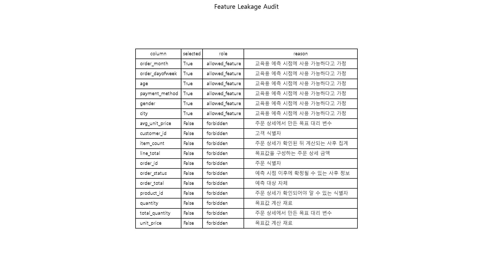
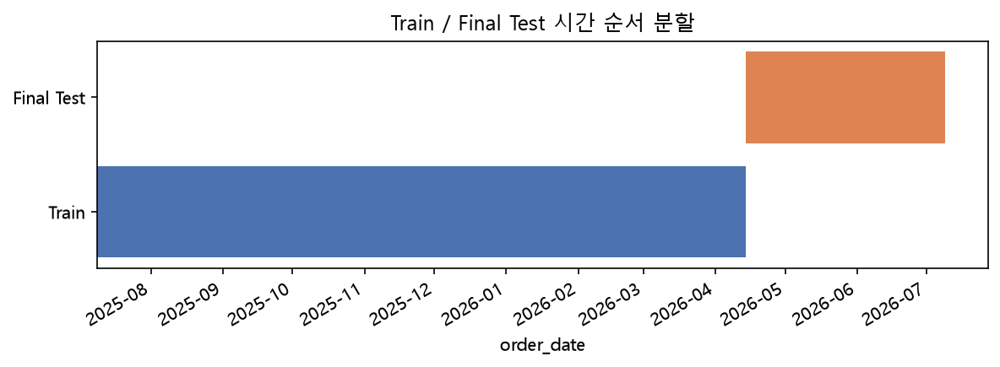
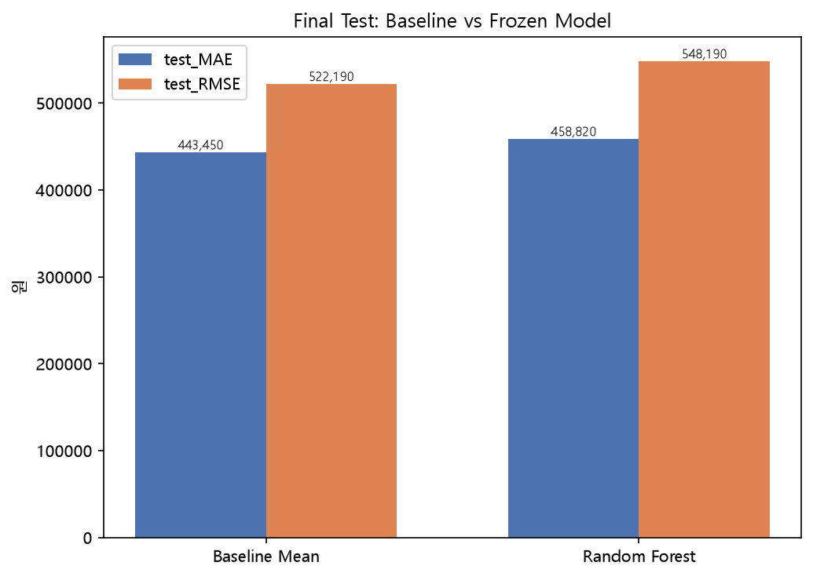
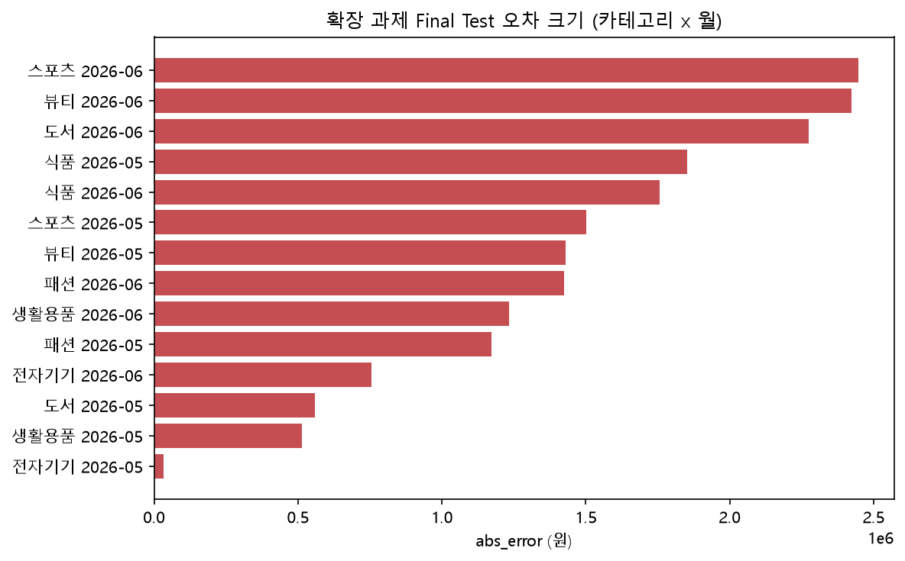

# Chapter 09 제출 답안. 회귀 분석으로 숫자 예측하기

> Chapter 09 실습 결과를 정리한 제출용 답안입니다.
> 상세한 코드와 실행 결과는 `chapter09.ipynb`에 있으며, 이 문서는 그 내용을 답안 양식에 맞춰 정리한 것입니다.

---

## 제출 정보

- 이름: 조영우
- GitHub ID: `cyw0927`
- 작성일: 2026-09-29
- 최종 Notebook URL:

```text
https://github.com/cyw0927/-llm-data-analysis-course/blob/main/assignments/chapter09/chapter09.ipynb
```

---

## 1. 예측 문제 정의

- Target: `order_total` (주문 1건의 주문 상세 금액 합계, 원 단위)
- 예측 단위: 주문 1건
- 예측 시점: 주문이 접수된 시점 — 주문 메타데이터(월/요일/결제수단)와 고객의 비식별 특성(성별/나이/지역)은 알고 있지만, 주문 상세(수량·단가·최종 금액)는 아직 확정되지 않은 시점
- 예측 시점에 알 수 있는 정보: `order_month`, `order_dayofweek`, `payment_method`, `age`, `gender`, `city`
- 예측 시점에 알 수 없는 정보: `quantity`, `unit_price`, `item_count`, `order_total` 등 주문 상세·사후 정보

### 나의 해석과 판단

실제 서비스라면 주문 상세가 이미 다 채워진 뒤에 금액을 "예측"하는 건 의미가 없다(이미 정답을 알고 있으므로). 그래서 상세 정보가 채워지기 전, 주문 메타데이터만 있는 시점을 예측 시점으로 정했다. 주문이 들어오자마자 대략적인 결제 규모를 미리 가늠할 수 있으면 상담·재고 우선순위를 정하는 데 참고 자료로 쓸 수 있을 것 같아서, 이 시점을 선택했다.

---

## 2. Feature Leakage Audit

| feature | 예측 시점 사용 가능 | Target 계산 재료 | 사후 정보/ID | 최종 사용 | 판단 이유 |
| --- | --- | --- | --- | --- | --- |
| order_month | O | X | X | 사용 | 교육용 예측 시점에 사용 가능하다고 가정 |
| order_dayofweek | O | X | X | 사용 | 교육용 예측 시점에 사용 가능하다고 가정 |
| age | O | X | X | 사용 | 교육용 예측 시점에 사용 가능하다고 가정 |
| payment_method | O | X | X | 사용 | 교육용 예측 시점에 사용 가능하다고 가정 |
| gender | O | X | X | 사용 | 교육용 예측 시점에 사용 가능하다고 가정 |
| city | O | X | X | 사용 | 교육용 예측 시점에 사용 가능하다고 가정 |
| order_total | X | Target 자체 | - | 제외 | 예측 대상 그 자체 |
| line_total | X | O | - | 제외 | 목표값을 구성하는 주문 상세 금액 |
| quantity | X | O | - | 제외 | 목표값 계산 재료 |
| unit_price | X | O | - | 제외 | 목표값 계산 재료 |
| item_count | X | - | 사후 집계 | 제외 | 주문 상세가 확인된 뒤 계산되는 사후 집계 |
| total_quantity | X | 대리 변수 | - | 제외 | 주문 상세에서 만든 목표 대리 변수 |
| avg_unit_price | X | 대리 변수 | - | 제외 | 주문 상세에서 만든 목표 대리 변수 |
| order_status | X | - | 사후 정보 | 제외 | 예측 시점 이후에 확정될 수 있는 사후 정보 |
| order_id | X | - | 식별자 | 제외 | 주문 식별자 |
| customer_id | X | - | 식별자 | 제외 | 고객 식별자 |
| product_id | X | - | 식별자 | 제외 | 주문 상세가 확인되어야 알 수 있는 식별자 |

- 금지 feature overlap 개수: 0개 (허용된 6개 feature 안에 금지 컬럼이 하나도 없음을 `validate_feature_columns()`로 확인)
- 가장 위험하다고 판단한 feature: `avg_unit_price`, `total_quantity`
- 이유: 이 두 값은 이름만 보면 평범한 통계처럼 보이지만, 실제로는 주문 상세를 미리 들여다보고 계산한 값이라 사실상 `order_total`과 거의 같은 정보를 담고 있다. 실수로 feature에 넣기 가장 쉬운 유형이라고 판단했다.



---

## 3. Target 생성과 관계 검증

### 계산 기준

```text
line_total = quantity * unit_price
order_total = 같은 order_id의 line_total 합계
```

- line_total 검증 결과: 불일치 0건 (`build_order_totals` 함수가 `quantity * unit_price`와 저장된 `line_total`이 다르면 즉시 예외를 던지는 구조라서, 셀이 에러 없이 끝난 것 자체가 불일치 0건이라는 증거)
- orders ↔ target 관계 검증 결과: `one_to_one` 통과
- orders → customers 관계 검증 결과: `many_to_one` 통과, 연결되지 않는 주문 0건

원본 데이터: customers `(150, 6)`, orders `(300, 7)`, order_items `(764, 6)` → 합쳐진 모델링 데이터는 주문 단위로 `(300, 11)`.

### 나의 해석과 판단

관계 검증 없이 그냥 `merge`만 했다면, 주문은 있는데 target이 없는 행이나 부모 주문이 없는 target이 생겨도 아무 경고 없이 통과되어 결측치나 이상한 값이 모델 입력에 그대로 섞여 들어갈 수 있었을 것이다. `validate=` 옵션 덕분에 이런 문제를 사람이 일일이 확인하지 않아도 코드가 먼저 걸러준다는 것을 확인했다.

---

## 4. Train / Final Test 분할

- Train 시작일: 2025-07-09
- Train 종료일: 2026-04-13
- Train 행 수: 244행 (81.33%)
- Final Test 시작일: 2026-04-14
- Final Test 종료일: 2026-07-08
- Final Test 행 수: 56행 (18.67%)
- 같은 달력 날짜 중복 여부: 없음 (Train 종료일 2026-04-13 < Final Test 시작일 2026-04-14)

### 분할 판단

실제로 이 모델을 서비스에 쓴다면, 예측 시점에는 항상 아직 오지 않은 미래 주문을 맞혀야 한다. 랜덤 분할을 쓰면 Test에 있는 주문의 패턴이 이미 Train 어딘가에 섞여 들어가 있을 수 있어서, 실제로는 모델이 보지 못했어야 할 정보를 미리 살짝 보게 되는 셈이다. 시간 순서로 나누면 "과거만 보고 미래를 맞히는" 실제 상황과 동일한 조건을 만들 수 있어서 이 방식을 선택했다.



---

## 5. Train TimeSeriesSplit 후보 비교

| 모델 | CV MAE 평균 | CV MAE 표준편차 | CV R² 평균 | 비고 |
| --- | ---: | ---: | ---: | --- |
| Baseline Mean | 423,004.81 | 44,153.04 | -0.0228 | 셋 중 CV MAE가 가장 낮음 |
| Random Forest | 437,352.80 | 26,318.79 | -0.1097 | 비베이스라인 중 CV MAE가 가장 낮음 |
| Linear Regression | 461,386.29 | 77,792.80 | -0.3105 | 표준편차가 가장 큼(fold마다 불안정) |

### Train CV로 선택한 비베이스라인 모델

- Selected Model: Random Forest
- 선택 기준: 비베이스라인 후보(Linear Regression, Random Forest) 중 Train CV MAE 평균이 더 낮은 모델
- Final Test 결과를 보기 전에 선택했는가: 예

### 나의 해석과 판단

CV 평균뿐 아니라 표준편차도 함께 봐야 하는 이유를 실감했다. Linear Regression은 평균만 보면 셋 중 가장 나쁘지만, 표준편차(77,792.80)까지 보면 fold마다 성능이 크게 흔들린다는 뜻이라 더 불안한 모델이라는 걸 알 수 있었다. 또한 Baseline Mean이 세 모델 중 CV MAE가 가장 낮았다는 점도 눈여겨봤다. 지금 쓰는 6개 feature만으로는 어떤 모델도 "그냥 Train 평균값으로 찍는 것"보다 나은 성능을 내지 못했다는 뜻이기 때문이다.

---

## 6. Final Test: Baseline vs Frozen Model

| 모델 | selection role | Train MAE | Test MAE | Test RMSE | Test R² | Baseline 대비 MAE 개선율 |
| --- | --- | ---: | ---: | ---: | ---: | ---: |
| Baseline Mean | baseline | 416,266.19 | 443,449.65 | 522,189.70 | -0.0011 | 0.00% |
| Random Forest | selected_by_train_cv | 326,438.48 | 458,819.92 | 548,190.45 | -0.1033 | **-3.47%** |



### 결과 관찰

Frozen Model(Random Forest)의 Final Test MAE(458,819.92원)가 Baseline(443,449.65원)보다 오히려 더 크다. 개선율은 **-3.47%**로 마이너스이고, R²도 -0.1033으로 음수다.

### 나의 해석과 판단

- Frozen Model이 baseline보다 실제로 개선되었는가? 아니다, 오히려 더 나빠졌다.
- MAE와 RMSE 차이에서 무엇을 볼 수 있는가? 두 모델 모두 RMSE가 MAE보다 훨씬 크다(Random Forest 기준 548,190 vs 458,820). 몇몇 주문에서 유난히 큰 오차가 나서 전체 평가를 끌어올리고 있다는 뜻으로 보인다.
- R²는 어떻게 해석할 수 있는가? Random Forest의 R²(-0.1033)는 "그냥 평균값으로 찍는 것"보다도 설명력이 낮다는 뜻이다. Train에서는 Random Forest가 Baseline보다 확실히 낮은 오차(326,438 vs 416,266)를 보였는데, Final Test에서는 뒤집힌 걸 보면 Train 데이터의 패턴을 다소 과하게 외운(overfit) 것일 수도 있다고 생각했다.

### 업무·분석적 의미

지금 허용된 feature(주문 월/요일, 고객 성별/나이/도시, 결제수단)만으로는 주문 금액의 변동을 설명하기 어렵다는 뜻이다. 이 모델을 그대로 서비스에 쓰면, "그냥 평균 금액으로 안내하는 것"보다 더 나쁜 추정치를 자신 있게 내놓을 위험이 있다.

---

## 7. 대표 오차 사례

### 사례 1 (order_id 51, 2026-06-15)

- 실제값: 1,877,000원
- 예측값: 605,528.72원
- residual: +1,271,471.29 (실제보다 낮게 예측)
- absolute error: 1,271,471.29원
- 관찰: 실제로는 아주 큰 금액을 주문했는데, 모델은 훨씬 적은 금액으로 예측했다.
- 가능한 이유 후보: 이 주문의 feature 조합이 평소 소액 주문들과 겉보기에 비슷해서, 모델이 "평범한 주문"으로 착각했을 가능성이 있다. 실제로 무엇을 얼마나 샀는지는 지금 feature로는 전혀 알 수 없다.
- 추가 확인: 이 고객이 원래도 고액 구매 성향인지, 이번이 우연히 컸던 주문인지는 지금 feature만으로는 구분할 수 없다.

### 사례 2 (order_id 168, 2026-06-11)

- 실제값: 10,000원
- 예측값: 897,415.39원
- residual: -887,415.39 (실제보다 높게 예측)
- absolute error: 887,415.39원
- 관찰: 실제로는 아주 적은 금액인데, 모델은 매우 큰 금액으로 예측했다.
- 가능한 이유 후보: Random Forest가 Train에서 "이런 feature 조합이면 보통 금액이 크다"는 패턴을 학습했는데, 이번 주문은 그 패턴에서 벗어난 예외적인 경우였을 수 있다.
- 추가 확인: 실제 상품 종류나 수량 정보가 있으면 원인을 더 좁혀볼 수 있겠지만, 지금 feature만으로는 알 수 없다.

> 원인을 데이터가 직접 보여주지 않으므로, 위 이유들은 가설로만 남겨두고 사실처럼 적지 않았다.

---

## 8. Validation Evidence

`reports/ch09_regression_validation.csv` 기준.

| check | value | status |
| --- | --- | --- |
| forbidden_feature_overlap | 0 | PASS |
| strict_train_before_test | True | PASS |
| selected_model_exists_in_train_cv | True | PASS |
| final_test_contains_baseline | True | PASS |
| final_test_contains_frozen_selected_model | True | PASS |
| test_rows_for_r2 | 56 | PASS |

### FAIL 항목

- 없음. 6개 항목 모두 PASS.

---

## 9. Evidence와 공개 범위

### 생성된 Evidence

- [x] `ch09_regression_split_summary.csv`
- [x] `ch09_regression_feature_audit.csv`
- [x] `ch09_regression_cv_summary.csv`
- [x] `ch09_regression_model_comparison.csv`
- [x] `ch09_regression_validation.csv`
- [x] `ch09_regression_checklist.csv`

### Internal 파일

- [x] `ch09_regression_model_data_internal.csv`
- [x] `ch09_regression_predictions_internal.csv`

### 공개 결과

- [x] `ch09_regression_report.md`
- [x] `ch09_actual_vs_predicted.png`
- [x] `ch09_residual_histogram.png`

### 공개 범위 판단

`order_id`가 포함된 예측 결과를 그대로 공개하면, 실제 주문 한 건 한 건을 역으로 찾아갈 수 있는 식별자가 외부에 노출된다. 분석 결과를 설명하는 데는 `order_id` 자체가 필요하지 않으므로, 공개용 보고서에는 이 식별자를 빼고 날짜·오차 수치만 남기기로 했다.

---

## 10. 최종 사용 판단

- [x] 현재 데이터로는 사용 보류

### 판단 근거

1. Train CV 단계에서부터 이미 `Baseline Mean`(423,004.81)이 `Random Forest`(437,352.80)와 `Linear Regression`(461,386.29)보다 오차가 더 작았다. 지금 feature로는 어떤 모델도 "그냥 평균값 찍기"를 이기지 못했다.
2. Final Test에서도 Selected Model(Random Forest)이 Baseline보다 MAE가 3.47% 더 나빴고, R²도 -0.1033으로 음수였다.
3. 현재 허용된 feature(주문 월/요일, 고객 성별·나이·지역, 결제수단)만으로는 주문 금액의 변동을 거의 설명하지 못한다고 판단했다.

### 업무적 위험

이 모델을 그대로 운영에 쓰면, 근거가 부족한 예측을 마치 그럴듯한 숫자처럼 보여줄 위험이 있다. "이번 달 평균 주문 금액은 얼마입니다"라고 안내하는 것보다 못한 추정치를 자신 있게 내놓을 수 있다.

### 현재 데이터의 한계

주문 금액을 실제로 좌우할 만한 정보(무엇을 얼마나 샀는지, 상품 카테고리, 고객의 과거 구매 이력 등)가 이번 예측 시점에는 전혀 허용되지 않았다. 인구통계 정보와 시간 정보, 결제수단만으로는 한계가 뚜렷하다.

### 다음 개선 우선순위

1. 고객별 "과거 평균 주문 금액"처럼, 예측 시점에도 미리 알 수 있는 이력 기반 feature를 추가로 검토한다.
2. 상품 상세 없이도 알 수 있는 고객 등급·세그먼트 정보를 확보할 수 있는지 확인한다.
3. 더 긴 기간의 데이터를 모아서 계절성이나 이벤트성 패턴이 있는지 다시 검증한다.

---

## 11. 전체 재실행 확인

실행 명령:

```powershell
python scripts/run_regression_analysis.py
```

- 실행 성공 여부: 예
- Train CV Selected Model: Random Forest (셀 단위로 실행했을 때와 동일)
- Final Validation 전체 PASS 여부: 예, 6개 항목 모두 PASS
- Notebook 결과와 스크립트 결과의 일관성: `random_state=42`로 고정되어 있어서, 셀에서 하나씩 실행한 결과와 `run_regression_analysis()`를 한 번에 실행한 결과가 완전히 같았다.

---

## 최종 체크

- [x] Target과 예측 시점을 정의했습니다.
- [x] Leakage Audit을 수행했습니다.
- [x] Target 계산과 관계 검증을 확인했습니다.
- [x] Train과 Final Test가 시간 순서로 엄격히 분리되었습니다.
- [x] 전처리가 Pipeline 내부에서 학습됩니다.
- [x] Train TimeSeriesSplit으로 후보를 비교했습니다.
- [x] Final Test 전에 Selected Model을 고정했습니다.
- [x] Final Test에서는 Baseline과 Frozen Model만 비교했습니다.
- [x] MAE, RMSE, R²를 함께 해석했습니다.
- [x] 대표 오차 사례를 관찰과 가설로 구분했습니다.
- [x] Validation Evidence가 모두 PASS입니다.
- [x] Internal 결과와 공개 결과를 구분했습니다.
- [x] 낮은 성능도 숨기지 않았습니다.
- [x] 전체 스크립트를 재실행했습니다.
- [ ] 최종 Notebook URL을 제출합니다.

---

## 12. 최종 확장 과제 (STEP 16~23)

기본 답안 양식(STEP 0~15)에는 없지만, 실습 가이드 확장분(STEP 16~23)까지 `chapter09.ipynb`에 이어서 작성했으므로 요약을 덧붙인다.

### 왜 확장 과제를 진행했는가

STEP 15까지 만든 `order_total` 예측은, 주문 상세(quantity, unit_price)를 이미 알고 있는 시점이라면 모델 없이 정확히 계산할 수 있는 값이었다. 즉 "왜 이 값을 미리 예측해야 하는가"에 약한 답을 가지고 있었다. 그래서 같은 프로젝트 데이터로 실제로 의미 있는 새 예측 문제를 다시 정의했다.

### 새로 정의한 예측 문제

과거 판매 데이터를 이용해 **다음 달 카테고리별 completed 주문 금액(매출)**을 예측한다. (고객별 예측은 고객당 평균 주문 2건 수준이라 반복구매 데이터가 부족해 배제, 상품별 예측도 표본이 더 희소해질 것으로 판단해 배제했다.)

- 예측 단위: category × month
- Prediction Horizon: 다음 1개월
- 사용 Feature: 직전 달 매출/주문건수/판매수량/평균주문금액, 예측 대상 달의 월 번호, category
- 제외 Feature: 예측 대상 달 자체의 매출/주문건수/판매수량/평균주문금액 (Target 구성 재료)

데이터를 만드는 과정에서 **2026-07이 7월 8일까지만 기록된 미완성 달**이라는 것을 발견해 분석 대상에서 제외했다. 카테고리 7개 × 11개월 = 77행을 최종 학습용 데이터로 사용했다.

### Train CV 비교 (walk-forward)

| 모델 | CV MAE 평균 | CV MAE 표준편차 | CV R² 평균 |
| --- | ---: | ---: | ---: |
| Baseline Mean | 818,803 | 93,838 | -0.502 |
| Random Forest | 870,745 | 237,098 | -0.711 |
| Linear Regression | 929,634 | 168,200 | -1.091 |

Selected Model: Random Forest (비베이스라인 중 CV MAE가 더 낮음, Final Test 전 고정)

### Final Test 결과

| 모델 | selection role | Train MAE | Test MAE | Test RMSE | Test R² | 개선율 |
| --- | --- | ---: | ---: | ---: | ---: | ---: |
| Baseline Mean | baseline | 963,767 | 1,286,405 | 1,444,402 | -3.835 | 0.00% |
| Random Forest | selected_by_train_cv | 722,470 | 1,384,066 | 1,556,543 | -4.615 | **-7.59%** |



### 결과 해석과 최종 판단

Train 기간 평균 매출(2,064,190원)과 Final Test 기간 평균 매출(777,786원)의 차이가 이 결과의 핵심 원인으로 보인다. 최근 두 달 들어 주문 자체가 눈에 띄게 줄어든 시기였는데, Baseline과 Random Forest 둘 다 이를 예측하지 못하고 과거 수준과 비슷하게 예측해서 크게 틀렸다.

- [x] 현재 데이터로는 사용 보류

**판단 근거**: (1) 카테고리 7개 × 11개월(77행)이라는 표본 규모가 매우 작다. (2) 직전 1개월 정보만 feature로 사용해 추세·계절성을 포착하지 못했다. (3) Final Test 구간의 매출 급감 원인을 지금 feature로는 설명할 수 없다.

**다음 개선 방향**: 여러 해에 걸친 월별 데이터를 더 확보하고, 매출 급감의 실제 비즈니스 원인을 데이터 밖에서 확인하며, 표본이 늘어난 뒤 이동평균·전년 동월 대비 같은 안정적인 feature를 추가로 시도한다.
