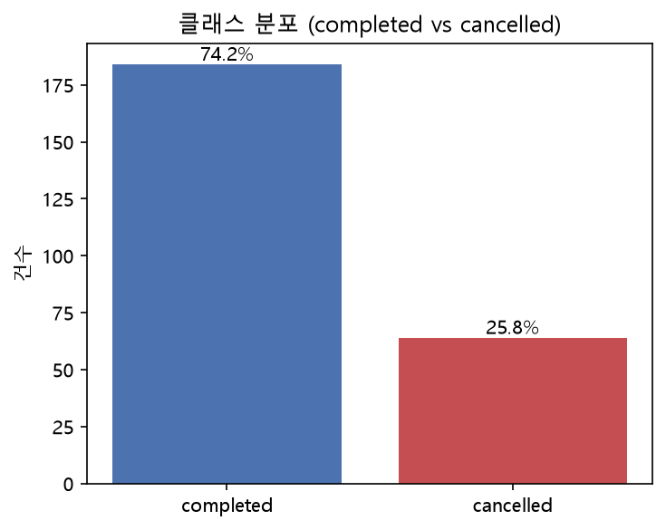
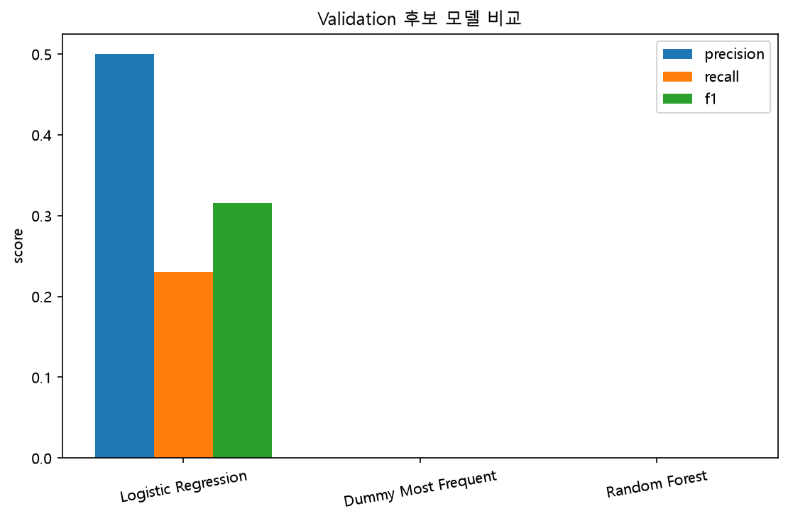
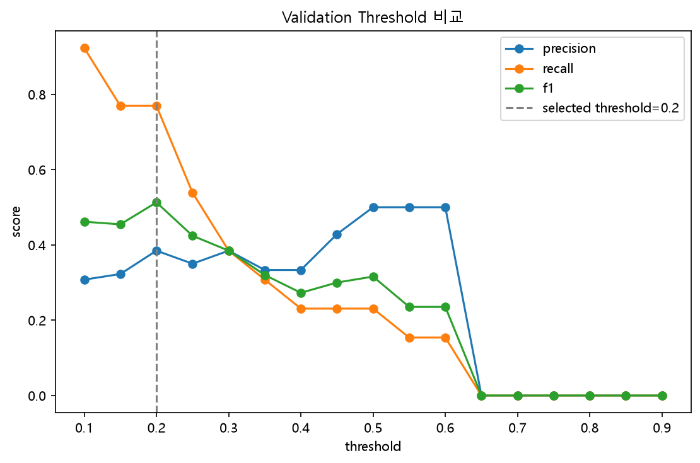
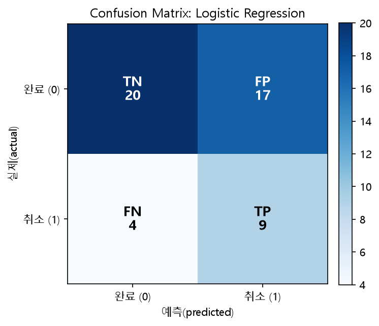

# Chapter 10 제출 답안. 분류 분석으로 주문 취소 여부 예측하기

> Chapter 10 실습 결과를 정리한 제출용 답안입니다.
> 상세한 코드와 실행 결과는 `chapter10.ipynb`에 있으며, 이 문서는 그 내용을 정리한 것입니다.

---

## 제출 정보

- 이름: 조영우
- GitHub ID: `cyw0927`
- 작성일: 2026-09-29
- 최종 Notebook URL:

```text
https://github.com/cyw0927/-llm-data-analysis-course/blob/main/assignments/chapter10/chapter10.ipynb
```

---

## 1. 타깃 정의와 예측 시점

- Target: `is_cancelled` (completed=0, cancelled=1). refunded 등 다른 상태는 모델링 대상에서 제외
- 예측 단위: 주문 1건
- 예측 시점: 주문이 생성된 직후
- 예측 시점에 알 수 있는 정보: `order_month`, `order_dayofweek`, `payment_method`, `age`, `gender`, `city`, `item_count`, `total_quantity`, `order_amount`, `category_count`, `dominant_category`, `customer_tenure_days`
- 예측 시점에 사용 금지: `order_status`, `is_cancelled`, `order_id`, `customer_id`, `product_id`, `cancel_reason`, `cancelled_at`

### 나의 해석과 판단

Chapter09(회귀, order_total 예측)에서는 수량·단가·금액을 전부 금지했지만, 이번엔 타깃이 "취소 여부"라서 오히려 주문 규모(품목 수, 수량, 금액)가 유용한 feature가 됩니다. 기준은 "주문 상세에서 왔는가"가 아니라 "예측 시점에 이미 확정되어 있는가"라는 것을 이번에 다시 확인했습니다.

---

## 2. 주문 단위 특징과 계산 관계 검증

```text
item_count 계산식: 주문 1건에 속한 order_items 행 수
total_quantity 계산식: 주문 1건의 quantity 합
order_amount 계산식: 주문 1건의 line_total 합 (line_total = quantity × unit_price로 먼저 검증)
```

| check | failing_rows |
| --- | ---: |
| quantity_positive | 0 |
| unit_price_positive | 0 |
| line_total_matches_quantity_times_unit_price | 0 |

원본 orders 300건 → completed(184) + cancelled(64) = **모델링 대상 248건** (refunded 52건 제외)

---

## 3. 병합 관계와 Feature Leakage Audit

| merge | relationship | left_rows | right_rows | unmatched_count |
| --- | --- | ---: | ---: | ---: |
| orders <-> order_item_features | one_to_one | 300 | 300 | 0 |
| orders -> customers | many_to_one | 300 | 150 | 0 |
| target scope filter (completed/cancelled only) | row_filter | 300 | 248 | 52 |

| feature | 예측 시점 사용 가능 | 최종 사용 | 판단 이유 |
| --- | --- | --- | --- |
| order_month / order_dayofweek | O | 사용 | 주문 생성 시점에 이미 확정 |
| age / gender / city | O | 사용 | 고객 비식별 특성 |
| payment_method | O | 사용 | 주문 생성 시점에 이미 확정 |
| item_count / total_quantity / order_amount | O | 사용 | 장바구니 내용, 주문 생성 시점에 이미 확정 |
| category_count / dominant_category | O | 사용 | 장바구니 카테고리 구성, 주문 생성 시점에 이미 확정 |
| customer_tenure_days | O | 사용(조건부) | 가입일이 주문일보다 이전일 때만 계산, 나머지는 결측 처리(아래 참고) |
| order_status | X | 제외 | Target을 그대로 담고 있는 사후 정보 |
| is_cancelled | X | 제외 | 예측 대상 자체 |
| order_id / customer_id / product_id | X | 제외 | 식별자 |
| cancel_reason / cancelled_at | X | 제외 | 취소 확정 후에만 존재(이 데이터엔 없음) |

### 발견한 것 — `signup_date`가 `order_date`보다 늦은 고객이 있었다

`customer_tenure_days`(가입 후 며칠 만에 주문했는지)를 만들려고 데이터를 확인하다가, **전체 300개 주문 중 56건(약 18.7%)** 이 "가입일이 주문일보다 나중"이라는 걸 발견했습니다. 이 56건은 주문이 생성되던 시점에는 `signup_date` 자체가 아직 존재하지 않았던 것이라, 그대로 tenure를 계산해 쓰면 예측 시점 이후에 생긴 정보를 쓰는 leakage가 됩니다. 그래서 가입일이 주문일보다 이전인 경우에만 tenure를 계산하고, 나머지(모델링 대상 248건 중 45건, 약 18.1%)는 값을 억지로 만들지 않고 결측으로 남겨 Pipeline의 median imputation이 처리하도록 했습니다. "데이터에 있으니 쓸 수 있다"가 아니라 "예측하는 바로 그 순간에 실제로 존재하는가"를 다시 확인한 사례였습니다.

---

## 4. 클래스 분포와 Dummy Baseline

| is_cancelled | label | count | ratio_pct |
| --- | --- | ---: | ---: |
| 0 | completed | 184 | 74.19% |
| 1 | cancelled | 64 | 25.81% |

불균형 여부: 약 3:1 정도로 완만하지만 뚜렷한 불균형이 있습니다. "무조건 완료로 찍는" Dummy 모델도 accuracy 74.19%가 나올 수 있지만, cancelled recall은 0%입니다. accuracy만으로는 판단할 수 없는 이유입니다.



---

## 5. Train / Validation / Test 역할 구분

| split | rows | ratio_pct | cancelled_count | cancelled_pct |
| --- | ---: | ---: | ---: | ---: |
| train | 148 | 59.68% | 38 | 25.68% |
| validation | 50 | 20.16% | 13 | 26.00% |
| test | 50 | 20.16% | 13 | 26.00% |

세 split 모두 취소 비율이 약 26%로 유지됩니다(stratified random split). 이번 분할은 교육용이며, 실제 운영 전에는 시간 순서 기반 out-of-time 평가가 추가로 필요하다는 한계를 기록해 둡니다.

---

## 6. Pipeline 전처리

- 숫자형: median imputation → StandardScaler
- 범주형: most_frequent imputation → OneHotEncoder(handle_unknown="ignore")
- 전처리는 Train에서만 `fit`, Validation·Test에는 `transform`만 적용

---

## 7. Validation 후보 모델 비교

| model | accuracy | precision | recall | f1 |
| --- | ---: | ---: | ---: | ---: |
| Logistic Regression | 0.74 | 0.50 | 0.2308 | 0.3158 |
| Dummy Most Frequent | 0.74 | 0.00 | 0.0000 | 0.0000 |
| Random Forest | 0.74 | 0.00 | 0.0000 | 0.0000 |

이번에도 Random Forest가 Dummy Baseline과 똑같이 precision/recall/F1이 전부 0으로 나왔습니다. Accuracy만 보면 셋 다 0.74로 그럴듯해 보이지만, Dummy와 Random Forest 둘 다 취소 주문을 단 한 건도 잡아내지 못했다는 뜻입니다. 표본이 148건뿐인 Train으로는 Random Forest(기본 threshold 0.5 기준)가 여전히 "전부 완료로 찍는" 모델과 다르지 않게 학습된 것으로 보입니다. feature를 3개 늘렸다고 이 문제가 저절로 해결되지는 않았습니다.

- Selected Model: **Logistic Regression**
- 선택 기준: F1 → Recall → Precision 순으로 비교, 유일하게 0이 아닌 F1(0.3158)을 보임
- Final Test를 보기 전에 선택했는가: 예



---

## 8. Validation Threshold 선택

| threshold | accuracy | precision | recall | f1 |
| --- | ---: | ---: | ---: | ---: |
| 0.10 | 0.44 | 0.3077 | 0.9231 | 0.4615 |
| 0.15 | 0.52 | 0.3226 | 0.7692 | 0.4545 |
| 0.20 | 0.62 | 0.3846 | 0.7692 | **0.5128** |
| 0.25 | 0.62 | 0.3500 | 0.5385 | 0.4242 |
| 0.30 | 0.68 | 0.3846 | 0.3846 | 0.3846 |
| 0.45 | 0.72 | 0.4286 | 0.2308 | 0.3000 |
| 0.50(기본값) | 0.74 | 0.5000 | 0.2308 | 0.3158 |
| 0.55~0.60 | 0.74 | 0.5000 | 0.1538 | 0.2353 |
| 0.65 이상 | 0.72~0.74 | 0.0000 | 0.0000 | 0.0000 |

Selected Threshold: **0.20** (F1 최고점, 0.5128 — 기본값 0.5의 F1(0.3158)보다 훨씬 높음)

### 업무 목적 관점의 판단
"취소 위험을 놓치지 않고 미리 대응"하는 목적이라면 precision이 다소 낮아지더라도 recall을 높이는 방향이 맞다고 판단했습니다. 다만 threshold=0.10처럼 극단적으로 낮추면 recall은 92%까지 오르지만 precision이 0.31까지 떨어져(취소 위험 알림 10건 중 7건이 헛알림) 오히려 신뢰를 잃을 수 있어, F1이 가장 균형 잡힌 0.20을 선택했습니다. FP가 늘어나는 만큼 후속 조치(안내 전화, 프로모션 등)에 드는 비용도 같이 고려해야 한다는 점은 10번 항목에서 더 다룹니다.



---

## 9. Final Test 결과

| model | selection_role | threshold | accuracy | precision | recall | f1 |
| --- | --- | ---: | ---: | ---: | ---: | ---: |
| Dummy Most Frequent | baseline | 0.5 | 0.74 | 0.0000 | 0.0000 | 0.0000 |
| Logistic Regression | selected_from_validation | 0.2 | 0.58 | 0.3462 | 0.6923 | 0.4615 |

### 결과 관찰
Frozen Model의 accuracy(0.58)는 Baseline(0.74)보다 여전히 낮습니다. precision·recall·F1은 Baseline이 전부 0인 반면 Frozen Model은 각각 0.35/0.69/0.46로, 취소 주문의 약 69%를 찾아냈습니다. 같은 threshold(0.2)의 **Validation** F1(0.5128)과 **Final Test** F1(0.4615)을 비교하면, 이번엔 그 차이가 feature 추가 전(Validation 0.5143 → Test 0.3529)보다 많이 줄었습니다.

### 나의 해석과 판단
feature를 3개(카테고리 다양성, 주요 카테고리, 가입 후 경과일) 추가한 뒤 Final Test F1이 0.3529 → 0.4615로 뚜렷하게 개선됐습니다. 특히 recall이 46%→69%로 크게 올라서, 실제 취소 주문을 더 많이 잡아내게 됐습니다. Validation과 Test의 성능 격차도 줄어든 걸 보면, 이번 feature들이 우연한 잡음이 아니라 실제로 취소 여부와 관련 있는 패턴(예: 가입한 지 얼마 안 된 고객, 특정 카테고리 위주의 주문 등)을 담고 있었을 가능성이 있다고 해석했습니다. 다만 여전히 accuracy는 Baseline보다 낮고, 표본도 작아서 "확실히 좋아졌다"고 단정하기보다는 "이 방향의 feature 추가가 도움이 될 수 있다는 근거를 하나 더 얻었다" 정도로 조심스럽게 판단했습니다.

### 업무·분석적 의미
recall 69%는 취소 주문 10건 중 7건 가까이를 미리 찾아낸다는 뜻이고, precision 35%는 취소 위험으로 분류한 주문 중 약 65%가 실제로는 정상 완료된다는 뜻입니다. 이 오차 수준이 업무에서 감당 가능한지는 FP/FN 비용을 알아야 확정할 수 있습니다.

---

## 10. Confusion Matrix와 FP/FN 해석

| cell | count |
| --- | ---: |
| TN (완료→완료) | 20 |
| FP (완료→취소위험) | 17 |
| FN (취소→완료) | 4 |
| TP (취소→취소위험) | 9 |

(TN+FP=37=전체 완료 주문 수, FN+TP=13=전체 취소 주문 수와 정확히 일치합니다.)

feature를 추가하기 전(TN22/FP15/FN7/TP6)과 비교하면, FN(취소인데 완료로 놓친 건수)이 7건→4건으로 줄고 TP(취소를 제대로 잡은 건수)가 6건→9건으로 늘었습니다. 대신 FP(완료인데 취소 위험으로 잘못 분류)는 15건→17건으로 조금 늘었습니다.



### FP 비용
정상적으로 완료될 주문(order_id 267, 9, 52 등)을 취소 위험으로 잘못 분류하면, 불필요한 안내 연락이나 할인 쿠폰 발송 같은 헛된 대응 비용이 발생할 수 있습니다.

### FN 비용
실제로 취소될 주문(order_id 292, 93, 128 등)을 완료로 예측해서 놓치면, 미리 대응할 기회를 완전히 놓치게 되고 재고·배송 준비를 그대로 진행하다가 손실이 더 커질 수 있습니다.

### 현재 목적에서 더 중요하게 볼 오류
"취소 위험을 놓치지 않고 미리 대응"이 목적이라면 FN(취소를 완료로 착각)의 비용이 더 클 가능성이 있다고 판단했습니다. FP는 안내 연락 정도의 비용이지만 FN은 대응 기회 자체를 잃는 것이기 때문입니다. feature를 추가한 뒤 FN이 줄고 TP가 늘어난 것은 이 목적에 정확히 맞는 방향의 개선이었습니다.

### 판단을 확정하려면 필요한 정보
FP 1건당 실제 대응 비용, FN 1건당 실제 손실 비용을 알아야 정확히 계산할 수 있습니다. 이 수업 데이터만으로 실제 비용을 확정하지 않았습니다.

---

## 11. Internal 결과와 Public 결과 구분

- Internal 컬럼: `order_id`, `actual_is_cancelled`, `predicted_is_cancelled`, `cancel_probability`, `model`, `threshold`, `outcome`
- Public 컬럼: `record_id`, `actual_is_cancelled`, `predicted_is_cancelled`, `cancel_probability`, `model`, `threshold` (order_id 없음)
- 공개 결과에 남아있는 금지 컬럼: **없음**

`order_id`가 포함된 표는 오류 분석에는 필요하지만, 외부 공개 시 실제 주문을 역추적할 수 있는 식별자가 노출되므로 공개용에는 순번(`record_id`)만 남겼습니다.

---

## 12. Validation Evidence

| check | value | status |
| --- | --- | --- |
| binary_target_contract | True | PASS |
| forbidden_feature_overlap | 0 | PASS |
| strict_merge_contract | True | PASS |
| all_splits_have_two_classes | True | PASS |
| selected_model_from_validation | True | PASS |
| selected_threshold_from_validation | 0.2 | PASS |
| public_prediction_privacy | 0 | PASS |
| test_rows_for_metrics | 50 | PASS |

8개 항목 모두 PASS입니다.

---

## 13. 전체 스크립트 재실행 확인

```powershell
python scripts/prepare_ch10_data.py
python scripts/run_classification_analysis.py
```

- 실행 성공 여부: 예
- Validation Selected Model: Logistic Regression (셀 단위 실행과 동일)
- Validation Selected Threshold: 0.2 (셀 단위 실행과 동일)
- Validation Evidence 전체 PASS 여부: 예
- Notebook과 스크립트 결과 일관성: `random_state=42`로 고정되어 완전히 동일하게 재현됨

---

## 14. LLM 검토와 최종 사용 판단

### LLM 활용 기록
- 사용 목적: Target Contract 검토, 주문 단위 feature 설계(추가 feature 3개 포함), Feature Leakage 점검, Validation 기반 모델/threshold 선택 로직 검토, FP/FN 업무 의미 해석
- 수정한 내용: (1) item_count/total_quantity/order_amount를 처음엔 금지하려다, 타깃이 금액이 아니라 취소 여부이므로 정상 feature임을 확인하고 허용 목록으로 옮김. (2) `customer_tenure_days`를 `order_date - signup_date`로 그냥 계산하려다, 56건(18.7%)에서 가입일이 주문일보다 늦다는 걸 발견하고 그 경우는 결측으로 남기도록 수정함 — LLM이 처음 제안한 "음수면 0으로 클리핑"은 값을 억지로 만드는 것이라 채택하지 않음. (3) Random Forest의 F1=0을 버그로 의심했으나 실제로는 표본 부족으로 인한 정상적인 현상임을 확인하고 다른 모델로 바꾸지 않음.
- 최종 판단은 누가 했는가: 분석자인 내가 Evidence 파일을 직접 확인한 뒤 결정함

### 최종 사용 판단
- [x] 추가 검증 후 사용 가능

### 판단 근거
1. Baseline(Accuracy만 높고 recall 0) 대비 Logistic Regression은 실제로 취소 주문의 69%를 찾아냈다(feature 추가 전 46%보다 개선).
2. precision은 35%로 여전히 낮아서, 취소 위험으로 분류된 주문 중 약 65%는 실제로 정상 완료된다.
3. Random split의 교육용 한계와 작은 표본(Test 50건, 취소 13건)을 감안하면 지금 수치를 그대로 운영 기준으로 쓰기는 이르다.

### 업무적 위험
FP/FN의 실제 업무 비용을 모른 채 이 threshold를 운영에 바로 적용하면 의도와 다른 방향으로 자원을 쓸 수 있습니다.

### 현재 데이터의 한계
- Random split(교육용) — 실제 운영 전 out-of-time 검증 필요
- Test 50건(취소 13건)으로는 신뢰구간이 넓음

### 다음 개선 우선순위
1. FP/FN 각각의 실제 업무 비용을 확인해서 threshold를 다시 조정한다.
2. 더 많은 주문 데이터를 모아 Random Forest 등도 안정적으로 평가할 수 있는 표본을 확보한다.
3. 시간 순서 기반 out-of-time 평가를 추가해서 이번 random split 결과와 비교한다.

---

## 최종 체크리스트

- [x] completed=0, cancelled=1만 사용했습니다.
- [x] refunded와 기타 상태를 타깃 범위에서 제외했습니다.
- [x] 예측 시점을 설명했습니다.
- [x] target, ID, 사후 정보를 feature에서 제외했습니다.
- [x] line_total = quantity × unit_price를 검증했습니다.
- [x] 주문 단위 특징과 병합 관계를 검증했습니다.
- [x] 클래스 비율을 확인했습니다.
- [x] Dummy baseline과 비교했습니다.
- [x] Train / Validation / Test 역할을 구분했습니다.
- [x] 전처리를 Pipeline 안에서 Train으로 학습했습니다.
- [x] 모델을 Validation에서 선택했습니다.
- [x] Threshold를 Validation에서 선택했습니다.
- [x] Final Test 전에 선택을 고정했습니다.
- [x] Accuracy, Precision, Recall, F1을 함께 해석했습니다.
- [x] FP/FN 업무적 의미를 작성했습니다.
- [x] 공개 결과에 원본 식별자가 없는지 확인했습니다.
- [x] Validation Evidence를 확인했습니다.
- [x] Random split의 교육용 한계를 기록했습니다.
- [x] 최종 사용 판단과 한계를 작성했습니다.
- [ ] GitHub에서 Notebook 렌더링을 확인합니다. (제출 직전)
- [ ] 최종 Notebook 파일 URL을 제출합니다. (제출 직전)
