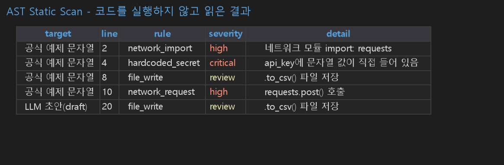
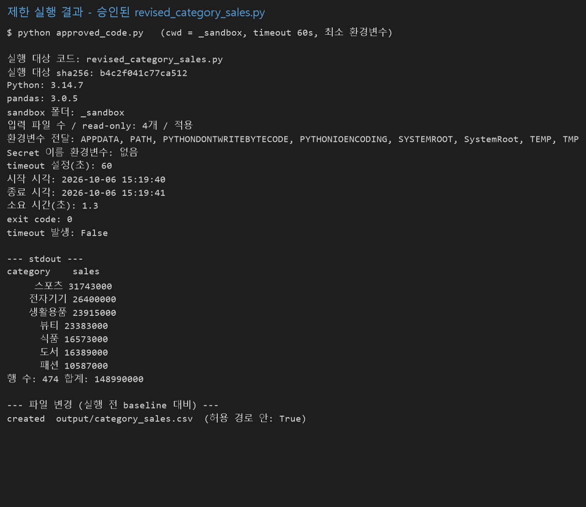
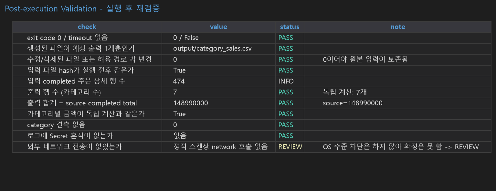

# Chapter 12 제출 답안. LLM이 만든 분석 코드를 검증하는 방법

> Chapter 12 실습 결과를 정리한 제출용 답안입니다.
> 상세한 코드와 실행 결과는 `chapter12.ipynb`에 있으며, 이 문서는 그 내용을 정리한 것입니다.
> 공통 검증 코드(`src/llm_code_validation.py`, `src/llm_code_validation_policy.py`, `scripts/run_llm_code_validation.py`)는 공식 저장소 파일을 받아 쓴 것이 아니라, 가이드의 함수 이름과 규칙에 맞춰 이 저장소에 직접 만든 것입니다.

---

## 제출 정보

- 이름: 조영우
- GitHub ID: `cyw0927`
- 작성일: 2026-10-06
- 최종 Notebook URL:

```text
https://github.com/cyw0927/-llm-data-analysis-course/blob/main/assignments/chapter12/chapter12.ipynb
```

---

## 0. processed 입력과 raw fallback 금지

- `data/processed/`의 4개 파일 확인: `customers_clean.csv`, `products_clean.csv`, `orders_clean.csv`, `order_items_clean.csv` (모두 존재)
- 없는 폴더를 가리키면 `FileNotFoundError`로 멈추고 raw로 대체하지 않음을 확인했습니다.

### 나의 해석과 판단
검증에서 raw fallback을 허용하지 않는 이유: 어떤 입력으로 검증했는지가 조용히 바뀌면, 중복·결측·FK 오류가 섞인 데이터로 검증하고도 PASS처럼 보일 수 있기 때문입니다.

---

## 1. 생성 코드가 하려는 일

검증 대상은 LLM에게 "카테고리별 매출 합계를 CSV로 저장"하라고 시킨 초안(`generated_code/draft_category_sales.py`)입니다.

흐름: `orders / order_items / products CSV 읽기` → `order_items + products left merge` → `+ orders left merge` → `amount = quantity × products.price` → `category별 합계` → `출력` → `C:/reports/category_sales.csv 저장`

- 목적: completed 주문의 카테고리별 매출 합계
- 영향 범위: 읽기 3개 파일, 쓰기 1개 파일(절대 경로)

---

## 2. Read Before Run - 분석 논리 점검 (실행 전)

| 확인 질문 | 읽어서 확인한 내용 | 판단 |
| --- | --- | --- |
| merge key | product_id, order_id | key는 맞지만 고유성 확인 없음 |
| merge 검증 | `how="left"`만 있고 validate / indicator / 행 수 확인 없음 | 위험 |
| 주문 상태 | orders를 merge하지만 `order_status`를 쓰지 않음 | 위험: 취소/환불 주문이 섞임 |
| 금액 계산식 | `quantity * products.price` | `line_total`을 쓰지 않음 |

## 3. Read Before Run - 실행 안전 점검 (실행 전)

| 확인 질문 | 읽어서 확인한 내용 |
| --- | --- |
| 읽는 파일 | `data/processed/` CSV 3개(상대 경로) |
| 쓰는 파일 | `C:/reports/category_sales.csv` 절대 경로, 덮어쓰기 가능 |
| 네트워크 / OS·Shell / subprocess | 없음 |
| package 설치 요구 | 없음 |
| Secret·환경변수·민감 경로 읽기 | 없음 |

아직 실행하지 않았습니다.

---

## 4. 스키마·PK·FK 검증

| dataset | rows | 필수 컬럼 | PK | PK 결측/중복 |
| --- | ---: | --- | --- | --- |
| customers | 150 | PASS | customer_id | 0 / 0 |
| products | 100 | PASS | product_id | 0 / 0 |
| orders | 300 | PASS | order_id | 0 / 0 |
| order_items | 764 | PASS | order_item_id | 0 / 0 |

| relationship | 부모 key 고유 | FK 결측 | orphan | status |
| --- | --- | ---: | ---: | --- |
| orders.customer_id → customers.customer_id | True | 0 | 0 | PASS |
| order_items.order_id → orders.order_id | True | 0 | 0 | PASS |
| order_items.product_id → products.product_id | True | 0 | 0 | PASS |

fail-fast 확인: `order_item_id`를 일부러 뺀 복사본은 required_column_check가 `FAIL`이 되고 `assert_validation_ready`가 `ValueError`로 멈췄습니다.

---

## 5. merge, completed 범위, line_total, 총합 대조

- `line_total = quantity × unit_price` 불일치: 0건
- merge 전 order_items 764행 → 후 764행(many_to_one), orders 미매칭 0, 날짜 변환 실패 0
- 주문 상태: completed 184 / cancelled 64 / refunded 52 → completed 주문 상세 **474행**
- products merge 후 474행, 미매칭 0, category 결측 0

| category | sales |
| --- | ---: |
| 스포츠 | 31,743,000 |
| 전자기기 | 26,400,000 |
| 생활용품 | 23,915,000 |
| 뷰티 | 23,383,000 |
| 식품 | 16,573,000 |
| 도서 | 16,389,000 |
| 패션 | 10,587,000 |

| 항목 | 금액 |
| --- | ---: |
| completed source total | 148,990,000 |
| category grouped total | 148,990,000 |
| monthly grouped total (2025-07 ~ 2026-07, 13개월) | 148,990,000 |

세 값이 같아서 PASS입니다.

### LLM 초안 논리를 데이터로만 비교 (초안은 실행하지 않음)

| 항목 | 값 |
| --- | ---: |
| 모든 상태 합계 (상태 필터 없는 초안 논리) | 255,610,000 |
| completed만 합계 | 148,990,000 |
| 차이 | 106,620,000 (초안이 71.6% 부풀림) |
| `products.price != unit_price` 행 수 | 0 |

### 나의 해석과 판단
상태를 거르지 않으면 취소·환불 주문까지 들어가 매출이 약 71.6% 부풀려지고, 에러는 나지 않습니다. `price`와 `unit_price`는 지금은 한 행도 다르지 않아 초안의 `quantity * price`가 지금 숫자를 틀리게 하지는 않지만, `line_total` 계약을 쓰지 않아 가격이 바뀌면 틀려질 수 있어 수정 대상으로 봤습니다.

completed 금액 합계 148,990,000은 회계상 순매출이 아닙니다. 할인·배송비·세금·부분 환불·정산 정보가 없어서 "completed 주문의 line_total 합계"까지만 말할 수 있습니다.

---

## 6. AST Static Scan



| 대상 | findings | 판정 |
| --- | ---: | --- |
| 공식 예제 문자열 | 4 (network_import high, hardcoded_secret critical, file_write review, network_request high) | BLOCKED |
| 내 LLM 초안 | 1 (file_write review, line 20) | REVIEW |
| `x = 1 + 1` | 0 | REVIEW |
| `open('.env').read()` | 0 | REVIEW |
| 개인 폴더 CSV 읽기 | 0 | REVIEW |

### 정적 스캔 0건이어도 안전을 보장할 수 없는 이유
`.env`나 개인 폴더를 읽기만 하는 코드는 스캔에서 0건으로 나옵니다. 또 내 초안은 스캔으로는 1건뿐이었지만 분석은 71.6% 부풀려진 틀린 코드였습니다. 정적 스캔은 위험한 호출이 있는지만 보고 분석이 맞는지는 못 봅니다. 그래서 0건은 SAFE가 아니라 REVIEW입니다.

한계: 이 스캐너는 제가 가이드의 대표 탐지 대상에 맞춰 만든 단순한 규칙이라, 문자열을 조합해 숨기는 코드는 못 잡을 수 있습니다.

---

## 7. 회귀·분류 Feature Contract

| problem | ALLOWED | FORBIDDEN | REVIEW |
| --- | ---: | ---: | ---: |
| regression | 6 | 11 | 0 |
| classification | 6 | 10 | 6 |

- 같은 `item_count`가 회귀에서는 FORBIDDEN, 분류에서는 REVIEW입니다.
- `order_total`, 회귀의 `item_count`, 분류의 `order_status`를 넣으면 모두 `ValueError`로 차단되었습니다.
- Chapter09 회귀 feature 6개: 모두 ALLOWED
- Chapter10 분류 feature 12개: ALLOWED 6개, REVIEW 6개(`item_count`, `total_quantity`, `order_amount`, `category_count`, `dominant_category`, `customer_tenure_days`), FORBIDDEN 0개

### Feature Leakage가 단순한 컬럼 이름 문제가 아니라 Prediction Time 문제인 이유
`item_count`는 금액을 예측할 때는 정답을 거의 그대로 알려 주지만 취소 여부를 예측할 때는 주문 생성 순간 이미 확정된 정보입니다. Chapter10에서 `customer_tenure_days`를 만들다가 56건(약 18.7%)에서 가입일이 주문일보다 늦다는 것을 발견해 결측으로 처리한 것이 같은 사례입니다. 이름만 보면 문제없어 보이는 값도 예측하는 시점에 실제로 존재하는지를 따져야 합니다.

한계: `category_count`, `dominant_category`, `customer_tenure_days`는 가이드 계약 목록에 없는, 제가 Chapter10에서 추가한 feature라 REVIEW로 직접 추가해서 점검했습니다.

---

## 8. Sandbox와 Package 검토

- Sandbox 체크리스트 9개 항목은 자동 결과가 전부 REVIEW이고, 임의로 PASS로 바꾸지 않았습니다.
- Package 설치 검토 10개 질문도 전부 REVIEW, 초기 결정은 `DO_NOT_INSTALL_UNTIL_REVIEWED`입니다. 이번 코드는 pandas만 쓰고 새 package가 필요 없어 이 결정을 유지합니다.

실습 9에서 실제 Evidence로 확인한 항목: 복사한 샘플만 사용, input read-only, Secret 이름 환경변수 없음, 쓰기 경로 allowlist(`output/` 밖 변경 0), 실행 전 baseline과 실행 후 변경 비교(파일 hash), timeout 60초.
적용하지 못한 항목: OS 수준 network 차단, CPU·메모리 제한 → REVIEW 유지.

---

## 9. Execution Gate

| axis | 공식 예제 | 내 초안 | 내 수정본 |
| --- | --- | --- | --- |
| schema_and_keys | PASS | PASS | PASS |
| aggregate_validation | PASS | PASS | PASS |
| ml_leakage | REVIEW | REVIEW | REVIEW |
| static_scan | **BLOCKED** | REVIEW | REVIEW |
| sandbox_and_package | REVIEW | REVIEW | REVIEW |
| human_approval | PENDING | PENDING | PENDING |
| execution_decision | **DO_NOT_EXECUTE** | HUMAN_REVIEW_REQUIRED | HUMAN_REVIEW_REQUIRED |

- DO_NOT_EXECUTE는 자동화 실패가 아니라 검사한 코드에 차단 사유가 있다는 뜻입니다.
- 내 초안이 HUMAN_REVIEW_REQUIRED였다고 해서 맞는 코드는 아닙니다. `aggregate_validation` PASS는 검증 함수가 통과했다는 뜻이지 내 초안 코드가 PASS라는 뜻이 아닙니다.
- Gate는 어떤 경우에도 자동으로 EXECUTE를 만들지 않습니다.

---

## 10. APPROVE / REVISE / BLOCK 판단

| 대상 | 판단 | 분석 타당성 | 실행 안전 |
| --- | --- | --- | --- |
| `draft_category_sales.py` | **REVISE** | FAIL (completed 범위, merge 검증 부족) | REVIEW (절대 경로 쓰기) |
| `revised_category_sales.py` | **APPROVE (제한 실행 후보)** | PASS | REVIEW (상대 경로 쓰기 1건, 제한 환경에서만) |

### 판단 근거
- 분석 타당성: 초안은 모든 상태를 합산해 255,610,000으로 completed 148,990,000보다 부풀렸고 merge 검증이 없었습니다.
- 실행 안전: 초안은 `C:/reports/category_sales.csv` 절대 경로에 덮어쓸 수 있었습니다. 네트워크·Shell·Secret 문제는 없었습니다.

## 11. LLM 초안과 사람 수정 내용

| 항목 | LLM 초안 | 내 수정 | 이유 |
| --- | --- | --- | --- |
| 주문 상태 범위 | 상태 필터 없음 | completed만 inner merge (`validate="many_to_one"`) | 모든 상태 255,610,000 vs completed 148,990,000 |
| merge 검증 | `how="left"`, validate/indicator 없음 | `validate` + `indicator=True` + assert | 키 중복/미매칭이 조용히 숫자를 바꿀 수 있음 |
| 금액 계산식 | `quantity * products.price` | `line_total` 사용 + 계산 관계 assert | 가격이 바뀌면 과거 주문 금액이 틀려짐 |
| 입력 가정 검증 | 키 고유성 확인 없음 | `orders.order_id`, `products.product_id` 고유성 assert | many_to_one 가정 보장 |
| 출력 경로 | `C:/reports/category_sales.csv` | `output/category_sales.csv` | 허용 경로 밖 쓰기 방지 |

수정본 재스캔: 1건(`line 35 file_write`, review) → REVIEW. 사람 수정 Log는 REVISE → 재검토 → APPROVE를 마친 뒤 `execution_approved = True`로 기록했고 `reports/ch12_student/ch12_human_revision_log.csv`에 저장했습니다.

한계: 이 승인은 학생인 제가 혼자 한 것입니다. 실제 업무라면 다른 사람의 추가 검토가 필요합니다.

---

## 12. 제한 실행 결과



- 실행 대상: APPROVE한 `revised_category_sales.py`만 (공식 예제 문자열과 초안은 실행하지 않음)
- exit code 0, timeout 없음, stderr 없음
- 출력 마지막 줄: `행 수: 474 합계: 148990000`
- 실행 전후 파일 변경: `output/category_sales.csv` created 1건, 허용 경로 안
- 적용한 제한: 복사본 `_sandbox`, 입력 read-only, 최소 환경변수만 전달, 쓰기는 `output/`만, 실행 전/후 hash 비교, timeout 60초

---

## 13. 실행 후 Post-execution Validation



| 결과 | 개수 | 항목 |
| --- | ---: | --- |
| PASS | 9 | exit code/timeout, 생성 파일 1개뿐, 수정·삭제 0건, 입력 hash 동일, 출력 행 수 7, 출력 합계 = source total(148,990,000), 카테고리별 금액이 독립 계산과 동일, category 결측 0, 로그에 Secret 흔적 없음 |
| INFO | 1 | 입력 completed 주문 상세 행 수 474 |
| REVIEW | 1 | 외부 네트워크 전송 없음 (정적 스캔 근거만 있고 OS 차단은 못 함) |

### 나의 해석과 판단
exit code 0은 11개 항목 중 하나일 뿐입니다. 수정본 코드의 계산을 그대로 믿지 않고 별도로 독립 계산한 값과 비교했기 때문에 "분석 결과가 맞다"고 말할 수 있었습니다. 코드 실행 성공은 분석 결과 검증 완료와 같지 않습니다.

한계: 독립 계산도 같은 입력 CSV를 같은 pandas로 다시 계산한 것이라 입력 데이터 자체의 정확성까지 확인한 것은 아닙니다.

---

## 14. 오류를 LLM에게 다시 물을 때

공통 Prompt Template(`build_error_fix_prompt_template`)을 확인했습니다.

- 공유: 분석 목적, 필요한 컬럼명만, 오류를 재현하는 최소 코드, 정리한 오류 메시지, 행 수·미매칭·총합 차이
- 공유하지 않음: 고객 원본 행, API Key, Token, DB password, 내부 URL, 개인 사용자 경로, 전체 환경변수, 민감 설정 파일
- 최소 재현 코드 안의 문자열 literal과 URL도 다시 확인

---

## 15. Evidence 파일

```powershell
python scripts/run_llm_code_validation.py
```

- 실행 성공(exit code 0), 검사 대상 코드는 실행하지 않음
- `reports/ch12_*`에 Evidence 파일 18개(CSV 16 + Markdown 2)와 `ch12_student/` 폴더 생성
- Notebook의 Execution Gate와 스크립트의 Gate가 일치

| 질문 | 기록 |
| --- | --- |
| 어떤 입력으로 생성했는가 | `data/processed/*_clean.csv` 4개 |
| 어떤 코드 버전을 검사했는가 | 공식 예제 문자열, draft, revised |
| PASS / REVIEW / BLOCKED | 공식 예제 BLOCKED, 내 초안·수정본 REVIEW |
| 사람이 무엇을 수정했는가 | 5가지 (11번 표) |
| 누가 어떤 근거로 승인했는가 | 나(학생), 분석 타당성 + 실행 안전 (단독 승인) |
| 실행 뒤 무엇이 바뀌었는가 | `output/category_sales.csv` 1개 생성, 나머지 변경 0 |

주의: `reports/ch12_human_revision_log.csv`는 스크립트 기본값(`execution_approved = False`)이고, 실제 REVISE → APPROVE 기록은 `reports/ch12_student/ch12_human_revision_log.csv`입니다.

---

## 16. 최종 신뢰 판단

- [x] 추가 검증 후 사용 가능 (대상: 수정본 `revised_category_sales.py`)

### 신뢰할 수 있는 범위
1. 이 데이터의 completed 주문 카테고리별 `line_total` 합계 계산 (스키마·키·merge·총합 대조·독립 계산 일치)
2. 제한 환경 실행 시 예상한 파일 1개만 만들고 원본 입력은 그대로였음

### 아직 신뢰할 수 없는 부분
1. "순매출"이라는 해석 (할인·배송비·세금·부분 환불 정보 없음)
2. 외부 네트워크 전송 없음 (OS 수준 차단 못 함, CPU·메모리 제한도 못 걸었음)
3. 정적 스캔 자체 (제가 직접 만든 단순 규칙)
4. 단독 승인
5. 작은 합성 데이터(주문 300건, 상세 764행)에서만 확인

### 다음 개선 우선순위
1. 네트워크 차단·자원 제한이 가능한 환경에서 다시 실행
2. 다른 사람의 코드·Evidence 재검토 추가
3. 정적 스캔 규칙을 공식 구현과 비교하고 놓치는 패턴 테스트 추가
4. 순매출 정의를 데이터와 함께 확정

### Chapter 13 연결
외부 데이터를 쓸 때는 출처, 이용 조건, 기준일, 원본 Snapshot, 메타데이터, 병합 key, 업데이트 주기, 해석 한계 계약이 추가로 필요합니다.

---

## 최종 체크리스트

- [x] Generated Code를 실행 전에 읽었습니다.
- [x] processed 입력에서 시작했습니다.
- [x] `order_items.order_item_id`를 포함한 필수 컬럼과 PK를 확인했습니다.
- [x] FK와 부모 key 고유성을 확인했습니다.
- [x] merge의 validate, 행 수, 미매칭을 확인했습니다.
- [x] `line_total = quantity × unit_price`를 검증했습니다.
- [x] completed 범위를 유지했습니다.
- [x] source total과 grouped total을 대조했습니다.
- [x] AST Static Scan을 실행했습니다.
- [x] 정적 스캔 0건을 SAFE로 해석하지 않았습니다.
- [x] 회귀와 분류 Feature Contract를 구분했습니다.
- [x] Sandbox와 Package 위험을 검토했습니다.
- [x] Execution Gate를 확인했습니다.
- [x] APPROVE / REVISE / BLOCK 판단과 근거를 작성했습니다.
- [x] LLM 초안과 사람 수정 내용을 구분했습니다.
- [x] APPROVE된 코드만 제한 환경에서 실행했습니다.
- [x] 실행 후 파일·행 수·범위·총합을 다시 검증했습니다.
- [x] 오류 공유 시 개인정보·Secret·내부 경로를 제거하는 방법을 정리했습니다.
- [x] 최종 코드의 신뢰 범위와 남은 한계를 작성했습니다.
- [ ] GitHub에서 Notebook 렌더링을 확인합니다. (제출 직전)
- [ ] 최종 Notebook URL을 제출합니다. (제출 직전)
